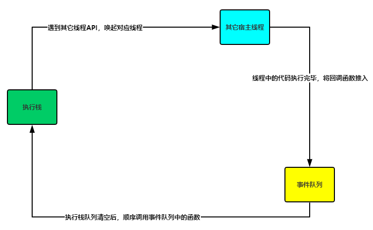

### 基本概念

1. **宿主环境**
    - JS所在的运行环境，一般为浏览器，但也有其它的宿主环境，例如：node;
    - 每个宿主环境都会提供不同的API供JS调用，例如浏览器中会包含`window`、`document`、`setTimeout`等API。
2. **JS执行引擎**：JS宿主环境中的一个功能模块，用于解析并执行JS代码。
3. **浏览器中的功能模块**：一个模块占用一个线程。
    - JS执行引擎
    - 计时器
    - 网络请求
    - 页面渲染
    - 事件监听
    
   > JS是单线程的原因是浏览器只会开一个JS执行引擎
   
4. **异步代码**：JS引擎里的代码都是同步执行的，只有新开一个线程才能执行异步代码，所以只有浏览器提供的`setTimeout`,`promise`等可以调用其它线程的API才能执行异步代码。

### 事件队列

用于存放执行栈清空后执行的异步代码，通常从计时器、网络请求、事件监听等其它线程中获取。

### 事件循环

1. JS代码只能在执行引擎中执行，每次执行一个函数都会将函数推入执行栈（具体内容可以查看文章：[JavaScript核心之执行上下文](https://juejin.im/post/5e5b22d0e51d4526ee0f813d)）；
2. 代码执行过程中遇到`setTimeout`等函数时，会调用宿主中的其它线程（计时器）；
3. 其它线程中的函数执行完成过后，如计时器计时完成后，会将回调函数加入事件队列；
4. 待执行栈所有同步代码执行完，执行栈清空后，JS引擎回去事件队列中看看有没有要执行的代码，有的话就入栈执行。

图解：



举个例子：这里以`setTimeout`为例，其它异步方法都是一样的

```js
setTimeout(function bar(){
    console.log('计时器回调执行');
}, 0)

function foo(){
    console.log('foo函数执行');
}

foo();
```

```js
//执行过程伪代码：
1. 执行栈入栈setTimeout函数；
执行栈：[setTimeout]
计时线程：[]
事件队列：[]

2. 浏览器遇到其它线程API，通知对应线程执行代码，此时浏览器唤起的是计时器线程，将setTimeout方法推入计时器线程；
执行栈：[]
计时线程：[setTimeout]
事件队列：[]

3. 执行栈继续执行后续代码，入栈foo函数，同时，计时线程中的setTimeout在计时；
执行栈：[foo]
计时线程：[setTimeout]
事件队列：[]

4. 计时完毕，计时线程将setTime方法的回调函数推入事件队列，然后计时器线程中的setTimeout执行完毕被销毁；
执行栈：[foo]
计时线程：[]
事件队列：[bar]

5. 执行foo函数，打印'foo函数执行'，foo执行完毕，foo函数出栈；
执行栈：[]
计时线程：[]
事件队列：[bar]

6. 执行栈没有可执行代码，会隔一段时间去事件队列中查看（事件轮询）一下有没有可执行代码，此时查看到有一个bar函数，将bar函数推入执行栈；
执行栈：[bar]
计时线程：[]
事件队列：[]

7. 执行bar函数，打印'计时器回调执行'，bar执行完毕，bar函数出栈；
执行栈：[]
计时线程：[]
事件队列：[]
```

> 从上述例子可以看出：
> 1.setTimeout的计时并不准确，计时完成后只是将回调函数推入事件队列，并不是马上执行，还要等执行栈清空后才会执行；
> 2.不管setTimeout的方法是不是写在最前面，计时时间有多短，都是在同步代码执行完毕后才会执行。

### 宏队列，微队列

事件队列又可以细分为宏队列和微队列，每次执行栈清空后会先执行微队列中的任务，再执行宏队列中的任务;
- 宏队列任务：计时器、网络请求、dom事件
- 微队列任务：`Promise.then`、`mutationObserver`

举个例子：

```js
setTimeout(function(){
    console.log('计时完成'); //3. 最后执行宏任务中的队列
}, 0);

new Promise(function(resolve, reject){
    console.log('promise 代码执行'); //1. 先执行，这里的代码是同步的
    resolve();
}).then(function(){
    console.log('promise resolve'); //2. 执行栈空了之后，先执行微队列中的任务
})
```

> 不管宏任务中的代码写在哪里，都是在微任务执行后再执行。因为浏览器会在微队列清空后再去看宏队列。

参考文章：
- [Tasks, microtasks, queues and schedules](https://jakearchibald.com/2015/tasks-microtasks-queues-and-schedules/)