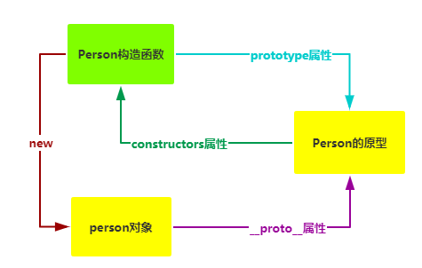
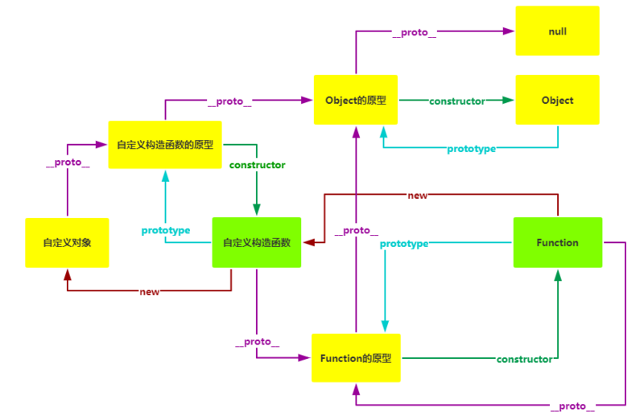

### 前置知识

#### JavaScript中一切皆对象。

1. 除了`undefined`之外所有的数据类型都是对象（引用类型）或者有其对应的包装类（原始类型）。

    - 原始值（不可变）
        - undefined
        - null
        - Boolean
        - Number
        - String
        - Symbol (es6新增)
        - BigInt (es6新增)
    - 引用类型
        - Object
        - Array
        - Function
        - RegExp
        - Date
        - Promise (es6新增)
        - Map (es6新增)
        - Set (es6新增)
        - WeakSet (es6新增)
        - WeakMap (es6新增)
        - ...
    ```js
    //null也是对象
    console.log(typeof null) //"object"
    ```

2. 所有对象都有其对应的构造函数，`null`除外。

    可以理解为所有对象都是由函数产生的，都可以使用`new`关键字创建，函数也是一个对象，由`Function`产生。
    
    ```JavaScript
    var num = new Number(); //数字
    var str = new String(); //字符串
    var bool = new Boolean(); //布尔值
    
    var obj = new Object(); //空对象
    ```
    
    ```JavaScript
    //定义一个函数
    function sum(a, b){
        return a + b;
    }
    
    //相当于下面的写法
    var sum = new Function("a", "b", "return a + b");
    ```

    ```JavaScript
    //自定义构造函数
    function Person(name, age){
        this.name = name;
        this.age = age;
    }
    
    var person = new Person('wlicox', 18); //自定义对象
    ```

### `new`一个对象的时候JS做了哪些事情

1. 隐式的创建一个`this`对象；
2. `this`对象中包括一个`prototype`属性，指向该构造函数的原型；
3. `prototype`对象中包括一个`construtor`属性，指向该构造函数本身；
4. 返回`this`。

用代码解释大概就是下面这样的:

假设有一个自定义构造函数`Person`，

```JavaScript
function Person(name, age){
    this.name = name;
    this.age = age;
}

var person = new Person('wlicox', 18);
```

当执行`var person = new Person('wlicox', 18)`时，

```JavaScript
function Person(name, age){
    //1.隐式的创建一个this对象
    var this = {
        //2.this对象中有一个prototype属性
        prototype: {
            construtor: Person //3.构造函数指回Person自己
        }
    };
    
     /*用户代码*/
    this.name = name;
    this.age = age;
    
    return this; //4.隐式的返回this
}
```

### 构造函数和普通函数的区别

1. 构造函数只做一件事，就是创建对象，普通函数可以提高编写的效率以及代码的复用等；
2. 构造函数的命名使用大驼峰，普通函数的命名使用小驼峰；
3. 构造函数的入参是作为创建对象的属性的值，普通对象的入参是用来提高函数的灵活性的；
4. 构造函数使用`new`关键字调用，普通函数使用`()`调用；
5. 构造函数不能有返回值，如果显式的返回一个引用类型的值，那么通过`new`创建的对象就是该返回值（返回原始类型的值不影响结果），普通函数有没有返回值都可以。
```JavaScript
function Person(name, age){
    this.name = name;
    this.age = age;
    return {};
}

var person = new Person('wilcox', 18)
console.log(person) //{}
```

### 原型`prototype`

1. 原型实际上就是一个普通的对象，每个构造函数创建的时候都有个自己的原型；
2. 构造函数通过`prototype`属性找到它的原型；
3. 构造函数创建的对象会继承其构造函数原型对象的属性；
4. **只有函数才有`prototype`属性，对象没有。**

### 构造函数`construtor`

原型对象中的属性，指向该构造函数本身；

```JavaScript
Person === Person.prototype.constructor //true
```

### 隐式原型`__proto__`

用构造函数生成的对象可以使用`__proto__`属性找到其构造函数的原型；

```JavaScript
//获取一个对象的原型的两种方法：
person.__proto__ === Person.prototype //true
Object.getPrototypeOf(person) === Person.prototype //true
```

### `prototype`、`construtor`、`__proto__`三者的关系




### 原型链
1. 每个对象都有`__proto__`属性，由`__proto__`属性串联起来的的对象的集合就是原型链；
2. 当一个对象在自己身上找不到要查找的属性时，就会顺着原型链往上找；


3. `Object`的原型处于原型链的最顶端，其中有一个`toSting`方法，这也就是为什么所有的数据类型都自带`toString`方法；
4. `null`没有原型；
5. 完整原型图：




>**注意：**
>- 因为对象都是由构造函数产生的，所以`Function` 是一开始就存在的。
>- 在js代码执行的时候，`Function`就被放入到内存中。
>- `Function`也是对象，但它没有构造函数，所以它的`__proto__`指向它自己的原型。

### 继承
圣杯模式，通过一个中间函数实现继承，修改子类原型不会影响到父类的原型。

```js
function inherit(Target, Origin){
    function F() {};
    F.prototype = Origin.prototype;    
    Target.prototype = new F();
    Target.prototype.constuctor = Target; //重置自己的构造函数
    Target.prototype.uber = Origin.prototype; //找到自己真正继承的类
}
```

> 圣杯模式是es5常用的继承方法，es6提供`class`方法用于创建类和`extend`用于继承。