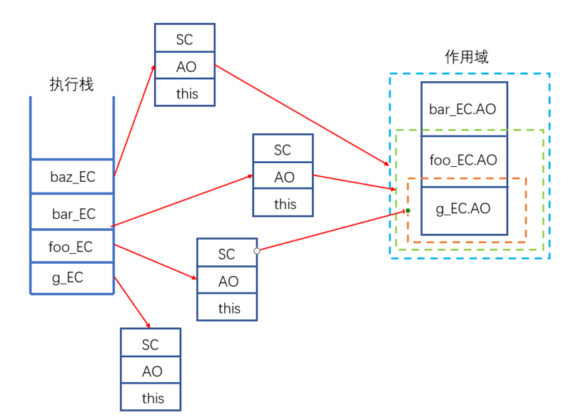

### 执行上下文EC（Execution Context）

1. 执行上下文就是一个函数或者全局代码**运行时**的环境，里面包括执行时需要用到的数据，可以理解为是一个对象；
2. 函数每次执行都会创建一个**新的**执行上下文；
3. 函数每次执行完毕都会销毁这个执行上下文；

### 执行栈CS（call stack）

1. 每次有函数执行就会生成一个新的执行上下文，而**组织管理执行上下文的栈**就是执行栈；
2. 当一个函数运行时，会在运行前生成一个执行上下文并入栈，函数运行结束就会出栈；
3. 每次正在运行的函数使用的都是栈顶的上下文；
4. 栈底永远是全局上下文。

举个例子：
```js
function foo() {
    console.log('foo函数执行了');

    function bar() {
        console.log('bar函数执行了');
    }
    
    bar();
}

foo();
```

代码执行时，执行栈如何变化

1. 创建全局上下文`G_EC`，并入栈。
    > 执行栈：
    >> G_EC 
2. 执行foo函数，创建`foo`的执行上下文`foo_EC`, 并入栈。
    > 执行栈：
    >> foo_EC
    >>
    >> G_EC
3. 执行`console.log`函数，创建`console.log`函数的执行上下文`clg_EC`, 并入栈。
    > 执行栈：
    >> clg_EC
    >>
    >> foo_EC
    >>
    >> G_EC
4. `console.log`执行完毕，打印出 'foo函数执行了'，销毁`clg_EC`，出栈。
    > 执行栈：
    >> foo_EC
    >>
    >> G_EC
5. 执行`bar`函数，创建`bar`的执行上下文`bar_EC`, 并入栈。
    > 执行栈：
    >> bar_EC
    >>
    >> foo_EC
    >>
    >> G_EC
6. 执行`console.log`函数，创建`console.log`函数的执行上下文`clg_EC`, 并入栈。
    > 执行栈：
    >> clg_EC
    >>
    >> bar_EC
    >>
    >> foo_EC
    >>
    >> G_EC
    
    **注意**：这里的```clg_EC```是一个全新的上下文，和上一个不一样，函数每次调用都生成一个新的独一无二的执行上下文。

7. `console.log`执行完毕，打印出 'bar函数执行了'，销毁`clg_EC`，出栈。
    > 执行栈：
    >> bar_EC
    >>
    >> foo_EC
    >>
    >> G_EC
8. `bar`函数执行完毕，销毁`bar_EC`, 出栈。
    > 执行栈：
    >> foo_EC
    >>
    >> G_EC
8. `foo`函数执行完毕，销毁`foo_EC`, 出栈。
    > 执行栈：
    >> G_EC
9. 全部代码执行完毕，销毁`G_EC`, 出栈。
    > 执行栈：
    >> 空

### 执行上下文中的内容

```js
//用代码表示一个执行上下文
EC = {
    VO = {...},
    SC = [...],
    this = {...}
}
```
#### 1. 变量对象VO（Varibale Object）

1. 在**函数运行**的**前一刻**生产；
2. 执行**栈顶部的VO**，又被称之为**执行对象AO（Active Object）**；
3. 执行**栈底部的VO**，又被称之为**全局对象GO（Global Object）**。

#### 2. 作用域链SC（Scope Chain）
1. 作用域链（Scope Chain）是一个数组，是执行上下文的集合，每个函数都有一个`[[scope]]`属性，指向一个数组，数组中保存的是除自己的执行上下文以外的其他执行上下文；
2. 作用域链是在函数定义时就产生的；
3. 当一个函数要使用一个变量时，会先从自己的执行上下文中查找，如果找不到，就会沿着作用域链往上找。

#### 3. this

>不影响执行作上下文的理解，可跳过。

`this`的指向问题:

1. 全局环境中，`this`指向`window`对象

    ```js
    console.log(this); //window
    ```

2. 函数中的`this`，指向`window`（严格模式中指向`undefined`）

    ```js
    function foo(){
        console.log(this); //window
    }

    foo();
    ```
    
3. 使用`call`、`apply`调用，`this`指向`call`/`apply`的第一个参数

    ```js
    var obj = {a: 1};

    function foo(){
        console.log(this); //obj
    }

    foo.call(obj);
    foo.apply(obj);
    ```
    
4. 调用对象中的函数，使用`obj.fun`方式调用，`this`指向`obj`

    ```js
    var obj = {
        a: 1,
        foo: function(){
            console.log(this);
        }
    };

    obj.foo(); //this指向obj

    var bar = obj.foo;
    bar(); //相当于将函数放在全局中执行，this指向window
    ```

### VO的创建过程

在一个函数的VO创建时，js引擎做的事情
1. 确定形参的值
2. 变量的声明提升
3. 将实参的值赋给形参
4. 函数声明整体提升

> 遇到同名属性则覆盖

举个例子：

```js
function foo(a, b){
    console.log(bar); //ƒ bar(){}
    console.log(a); //2

    function bar(){}
    
    var a = 1;
}

foo(2, 3);
```

按照创建步骤生成foo函数的VO——foo_VO

```js
//1. 确定形参的值，一开始有两个形参的值
foo_VO = {
    arguments: {...}, //arguments一开始就会在
    a: undefined,
    b: undefined,
}

//2. 变量声明提升， 内部有一个变量声明a，当前VO对象已经有a属性，所以不变
foo_VO = {
    arguments: {...},
    a: undefined,
    b: undefined,
}

//3. 将实参的值赋给形参，执行foo(2, 3)时传入了实参2, 3，分别赋值给a, b
foo_VO = {
    arguments: {...},
    a: 2,
    b: 3,
}

//4. 函数声明提升， 有一个函数foo，将foo函数作为VO的属性
foo_VO = {
    arguments: {...},
    a: 2,
    b: 3,
    foo: function(){}
}
```

所以最后foo函数产生的VO对象就是

```js
foo_VO = {
    arguments: {...},
    a: 2,
    b: 3,
    foo: function(){}
}
```

> 因为VO是在函数运行前创建的，函数在运行的时候就可以在当前VO中查找变量，所以这就解释了为什么`console.log`放在函数的最前面也可以打印`a`和`foo`的值。

### SC的内容

**SC = 上一层执行上下文栈的AO + 上一层执行上下文栈的SC**

举个例子：

```js
function foo() {
    function bar() {
        function baz(){
            
        }
    }
}
```

全局执行上下文，一开始的SC为空

```js
g_EC = {
    SC: [],
    AO: {...},
    this: {...},
}
```

foo函数执行上下文，其中SC =  全局上下文的AO + 全局上下文的SC

```js
foo_EC = {
    SC: [g_EC.AO], //[g_EC.AO, ...g_EC.SC]
    AO: {...},
    this: {...},
}
```

bar函数执行上下文，其中SC =  foo函数执行上下文的AO + foo函数执行上下文的SC

```js
bar_EC = {
    SC: [foo_SC.AO, g_EC.AO], //[foo_SC.AO, ...foo_SC.SC],
    AO: {...},
    this: {...},
}
```

baz函数执行上下文，其中SC =  bar函数执行上下文的AO + bar函数执行上下文的SC

```js
baz_EC = {
    SC: [bar_SC.AO, foo_SC.AO, g_EC.AO], //[bar_SC.AO, ...bar_SC.SC],
    AO: {...},
    this: {...},
}
```

作用域图解：



> 函数运行时，查找变量，会先查找自己的AO。如果没有，再依次沿着SC的第0项、第1项... 往后找。找到SC的最后一项都没有找到就会报错：`Uncaught ReferenceError: xxx is not defined`

### 闭包

当一个函数中的函数被保存到该函数的外部就会形成闭包。

```js
function foo(){
    var a = 1;
    return function bar(){
        return a;
    }
}

var baz = foo();
var qux = baz();

console.log(qux); //1
```

`foo`在运行的时候

```js
foo_EC = {
    SC: [GO],
    AO: {
        a: 1,
        ...
    },
    this: {...},
}
```

当`foo`运行完毕后会销毁自己的执行上下文，其中的AO也被销毁

但是由于`bar`被保存到了外部， 也就是`baz`中，而`bar`的作用域SC中有`foo`的AO，所以这就解释了为什么形成闭包时，外部的函数可以使用函数内部的变量。

```js
baz_EC = {
    SC: [foo_EC.AO, GO],
    AO: {...},
    this: {...},
}
```

> 因为`bar`函数被保存到全局作用域中，其中的`foo`的AO一直存在，无法被销毁，会造成内存泄露；
>
> 在使用完毕后应该去掉原来的闭包`baz = null`

闭包的作用：
1. 实现公有变量；
2. 可以做缓存；
3. 实现属性私有化；
4. 模块化开发，防止污染全局变量。