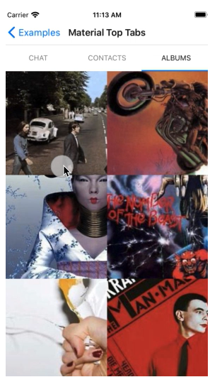
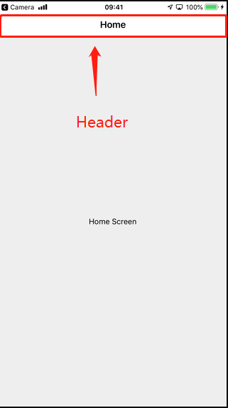
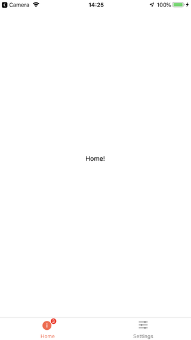
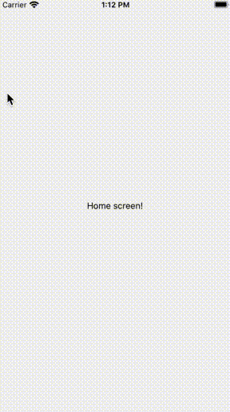

# [React-Navigation 5 快速入门](https://reactnavigation.org/docs/getting-started)

- 什么是`react-navigation`?
- 安装与使用
- `react-navigation`的基本功能
  - 基础组件
  - 页面跳转
  - 路由传参
- Hooks
- 常见案例


## React-Navigation 5简介

React Native的知识只能实现单个页面操作，为了实现React Native App中**不同页面之间的跳转与传值**，需要引入路由导航功能。

React-Navigation是一个用于实现路由和导航功能的框架。

### 优点

- 使用简单：内置了很多导航器，提供无缝的开箱即用体验。
- 多端适配：提供特定于平台的外观以及流畅的动画和手势。
- 可高度定制化：只要懂如何使用JavaScript编写App，就可以定制React-Navigation的任何部分。
- 可扩展：React-Navigation的每一层都是可扩展的，可以编写自定义的导航器甚至替换原有面向用户的api。

### 版本变更

React-Navigation 5和之前的版本完全不同，不兼容之前的版本。如果要从v4迁移到v5，可以使用[兼容层](https://reactnavigation.org/docs/compatibility)，具体步骤可参考[文档](https://reactnavigation.org/docs/upgrading-from-4.x)。

#### 主要变更内容

##### 基于组件的配置

之前的版本是静态配置的，现在的版本是基于组件的，可以动态配置，灵活性更高。

##### 新的hook

钩子对于有状态逻辑和代码组织非常有用。现在我们有了几个常见用例的钩子。

- [`useNavigation`](https://reactnavigation.org/docs/use-navigation.html)
- [`useRoute`](https://reactnavigation.org/docs/use-route.html)
- [`useNavigationState`](https://reactnavigation.org/docs/use-navigation-state.html)
- [`useFocusEffect`](https://reactnavigation.org/docs/use-focus-effect.html)
- [`useIsFocused`](https://reactnavigation.org/docs/use-is-focused.html)
- [`useLinking`](https://reactnavigation.org/docs/use-linking.html)
- [`useScrollToTop`](https://reactnavigation.org/docs/use-scroll-to-top.html)

##### 新的主题API

在React Navigation中，有基本的浅色主题和深色主题。

现在提供了主题系统用于自定义导航的外观。

```javascript
const MyTheme = {
  dark: false,
  colors: {
    primary: 'rgb(255, 45, 85)',
    background: 'rgb(242, 242, 242)',
    card: 'rgb(255, 255, 255)',
    text: 'rgb(28, 28, 30)',
    border: 'rgb(199, 199, 204)',
  },
};
```

##### 支持Typescript

新版本React Navigation使用Typescript重写，提供了自动补全和类型检查功能。


[类型描述](https://reactnavigation.org/docs/typescript/)

##### Redux DevTools 集成

不需要额外配置，也不需要集成Redux到app中即可使用。


##### 原生栈导航器

一般来说，我们使用JavaScript编写导航器以获取更好的定制性，这是适用于大多数使用场景，但是如果你想要完全原生的交互体验，可以使用[`react-native-screens`](https://github.com/kmagiera/react-native-screens)库，其内部是使用原生组件实现的。


##### 原生Material头部导航器



使用：

```react
import ViewPagerAdapter from 'react-native-tab-view-viewpager-adapter';

// ...

<Tab.Navigator pager={props => <ViewPagerAdapter {...props} />}>
  {...}
</Tab.Navigator>
```

或者

```react
import { ScrollPager } from 'react-native-tab-view';

// ...

<Tab.Navigator pager={props => <ScrollPager {...props} />}>
  {...}
</Tab.Navigator>
```


## 术语表

### Header

也称为导航头，导航栏，导航条，可能还有很多其他东西。这是屏幕顶部的矩形，它包含屏幕的back按钮和标题。在React导航中，顶上的矩形区域通常称为头部。



### NavigationContainer

导航容器，导航容器是一个管理导航树并包含导航状态的组件。该组件必须包装所有导航器结构。通常，我们会将这个组件呈现在应用程序的根目录下，这个根目录通常是从app .js导出的组件。

### Screen

页面，屏幕元素。

### Navigator

导航器，导航器将[屏幕元素](#Screen)作为子元素来定义路由的配置。

```react
function App() {
  return (
    <NavigationContainer>
      <Stack.Navigator> // <---- 导航器
        <Stack.Screen name="Home" component={HomeScreen} />
      </Stack.Navigator>
    </NavigationContainer>
  );
}
```

### Screen component

屏幕组件是我们在路由配置中使用的组件。

```react
const Stack = createStackNavigator();

const StackNavigator = (
  <Stack.Navigator>
    <Stack.Screen
      name="Home"
      component={HomeScreen} // <----
    />
    <Stack.Screen
      name="Details"
      component={DetailsScreen} // <----
    />
  </Stack.Navigator>
);
```

###  Navigation Prop

导航属性，此属性将被传递到所有屏幕，可用于以下操作：

- `dispatch` 将动作发送到路由器
- `navigate`, `goBack`, 等方法可以以一种更简单的方式派发动作

###  Route prop

路由属性，此属性将被传送到所有屏幕。包含当前路由的信息，例如`params`，`key`和`name`。

###  Navigation State

导航器状态，导航器的状态通常如下所示

```react
{
  key: 'StackRouterRoot',
  index: 1,
  routes: [
    { key: 'A', name: 'Home' },
    { key: 'B', name: 'Profile' },
  ]
}
```

在这个导航器状态中，包含了两个路由（可能是tabs或者是栈中的卡片）。index代表了当前激活的路由的索引，即"B"。

### Route

路由，每个路由都是一个导航状态，其中包含标识它的键和指定路由类型的“名称”。它还可以包含任意参数:

```react
{
  key: 'B',
  name: 'Profile',
  params: { id: '123' }
}
```


## 安装使用

1. 安装`@react-navigation/native`库

   **npm**

   ```powershell
   npm install @react-navigation/native
   ```

   **yarn**

   ```powershell
   yarn add @react-navigation/native
   ```

2. 在React Naive项目中安装其他依赖

   **npm**

   ```powershell
   npm install react-native-reanimated react-native-gesture-handler react-native-screens react-native-safe-area-context @react-native-community/masked-view
   ```

   **yarn**

   ```powershell
   yarn add react-native-reanimated react-native-gesture-handler react-native-screens react-native-safe-area-context @react-native-community/masked-view
   ```

   React Native 0.60 及以上版本不需要运行`react-native linking` ，linking是自动的。

   如果在Mac中开发需要安装pods依赖：

   ```powershell
   npx pod-install ios
   ```

   最后在你的入口文件，如`index.js`或者`App.js`文件的最上方加入这行代码：

   ```react
   import 'react-native-gesture-handler';
   ```

   > 如果跳过这一步，在生产环境中可以能会闪退

   

## 基础案例展示

### Stack navigator

栈导航器的使用

1. 安装依赖

   **npm**

   ```powershell
   npm install @react-navigation/stack
   ```

   **yarn**

   ```powershell
   yarn add @react-navigation/stack
   ```

2. 使用

   ```react
   // In App.js in a new project
   
   import * as React from 'react';
   import { View, Text } from 'react-native';
   import { NavigationContainer } from '@react-navigation/native';
   import { createStackNavigator } from '@react-navigation/stack';
   
   // 首页
   function HomeScreen() {
     return (
       <View style={{ flex: 1, alignItems: 'center', justifyContent: 'center' }}>
         <Text>Home Screen</Text>
       </View>
     );
   }
   
   // 详情页
   function DetailsScreen() {
     return (
       <View style={{ flex: 1, alignItems: 'center', justifyContent: 'center' }}>
         <Text>Details Screen</Text>
       </View>
     );
   }
   
   const Stack = createStackNavigator(); // 创建一个栈导航器
   
   // 根组件
   function App() {
     return (
       <NavigationContainer>
         <Stack.Navigator>
           <Stack.Screen name="Home" component={HomeScreen} />
           <Stack.Screen name="Details" component={DetailsScreen} />
         </Stack.Navigator>
       </NavigationContainer>
     );
   }
   
   export default App;
   ```

   - `NavigationContainer`：是一个管理导航树，包含了导航状态的组件。必须放在最外层，包裹所有的导航器结构。

   - `createStackNavigator`： 是一个函数，返回一个对象，这个对象包含了两个属性`Screen`和`Navigator`，`Navigator`应该包含`Screen`作为他的子组件来定义路由结构。

     - `Stack.Navigator`
       - `initialRouteName` : 指定初始路由
       - `screenOptions`: 页面共享配置对象

     - `Stack.Screen`
       - `name`: 页面名，用于页面跳转时指定
       - `component`: 页面对应组件
       - `options`: 页面配置对象
       - `initialParams`: 页面默认参数

3. 页面间的跳转

   **跳转到一个新页面**

   ```react
   import * as React from 'react';
   import { Button, View, Text } from 'react-native';
   import { NavigationContainer } from '@react-navigation/native';
   import { createStackNavigator } from '@react-navigation/stack';
   
   function HomeScreen({ navigation }) {
     return (
       <View style={{ flex: 1, alignItems: 'center', justifyContent: 'center' }}>
         <Text>Home Screen</Text>
         <Button
           title="Go to Details"
           onPress={() => navigation.navigate('Details')}
         />
       </View>
     );
   }
   
   // ... other code from the previous section
   ```

   - 每一个**screen**组件都包含一个`navigation`对象，使用对象中的`navigate`方法进行跳转。
   - `navigate('Details')`：使用screen名称进行跳转。

   **多次跳转到同一个页面**

   ```react
   <Button
     title="Go to Details... again"
     onPress={() => navigation.push('Details')}
   />
   ```

   - 使用`navigation.push`方法

   > push和navigate的区别：push不管是不是相同的页面都会见页面入栈，navigate只会入栈新的页面（和栈顶不同的页面）。

   **返回上一个页面**

   ```react
   <Button title="Go back" onPress={() => navigation.goBack()} />
   ```

   - 使用`navigation.goBack`方法

   **返回初始路由页面**

   ```react
   <Button
   	title="Go back to first screen in stack"
   	onPress={() => navigation.popToTop()}
   />
   ```

   - 使用`navigation.popToTop()`方法

4. 路由间传值

   - 使用`navigation.navigate('RouteName', { /* params go here */ })`方法的第二个参数传递参数。
   - 使用`route.params`获取参数。

   ```react
   function HomeScreen({ navigation }) {
     return (
       <View style={{ flex: 1, alignItems: 'center', justifyContent: 'center' }}>
         <Text>Home Screen</Text>
         <Button
           title="Go to Details"
           onPress={() => {
             /* 1. 跳转到详情页面并且传递一些值 */
             navigation.navigate('Details', {
               itemId: 86,
               otherParam: 'anything you want here',
             });
           }}
         />
       </View>
     );
   }
   
   function DetailsScreen({ route, navigation }) {
     /* 2. 获取上一个路由传过来的值 */
     const { itemId, otherParam } = route.params;
     return (
       <View style={{ flex: 1, alignItems: 'center', justifyContent: 'center' }}>
         <Text>Details Screen</Text>
         <Text>itemId: {JSON.stringify(itemId)}</Text>
         <Text>otherParam: {JSON.stringify(otherParam)}</Text>
         <Button
           title="Go to Details... again"
           onPress={() =>
             navigation.push('Details', {
               itemId: Math.floor(Math.random() * 100),
             })
           }
         />
         <Button title="Go to Home" onPress={() => navigation.navigate('Home')} />
         <Button title="Go back" onPress={() => navigation.goBack()} />
       </View>
     );
   }
   ```

   - 每一个**screen**组件除了包含一个`navigation`对象之外，还有一个`route`对象，使用`route.params`获取路由参数。

   **页面初始参数**

   ```react
   <Stack.Screen
     name="Details"
     component={DetailsScreen}
     initialParams={{ itemId: 42 }}
   />
   ```

   - 如果要定义页面初始参数，使用`initialParams`属性。

   **将页面传递回上一个页面**

   - 传递参数也是使用`navigation.navigate('RouteName', { /* params go here */ })`

   - 接收参数可以使用`useEffect`监听是否有对应的参数传递回来。

   ```react
   function HomeScreen({ navigation, route }) {
     // 监听post参数是否存在
     React.useEffect(() => {
       if (route.params?.post) {
         // Post updated, do something with `route.params.post`
         // For example, send the post to the server
       }
     }, [route.params?.post]);
   
     return (
       <View style={{ flex: 1, alignItems: 'center', justifyContent: 'center' }}>
         <Button
           title="Create post"
           onPress={() => navigation.navigate('CreatePost')}
         />
         <Text style={{ margin: 10 }}>Post: {route.params?.post}</Text>
       </View>
     );
   }
   
   function CreatePostScreen({ navigation, route }) {
     const [postText, setPostText] = React.useState('');
   
     return (
       <>
         <TextInput
           multiline
           placeholder="What's on your mind?"
           style={{ height: 200, padding: 10, backgroundColor: 'white' }}
           value={postText}
           onChangeText={setPostText}
         />
         <Button
           title="Done"
           onPress={() => {
             // 将参数传递回首页
             navigation.navigate('Home', { post: postText });
           }}
         />
       </>
     );
   }
   ```

   **嵌套路由间传递值**

   假设有如下路由结构:

   ```react
   function Home() {
     return (
       <Tab.Navigator>
         <Tab.Screen name="Feed" component={Feed} />
         <Tab.Screen name="Messages" component={Messages} />
       </Tab.Navigator>
     );
   }
   
   function App() {
     return (
       <NavigationContainer>
         <Stack.Navigator>
           <Stack.Screen name="Home" component={Home} />
           <Stack.Screen name="Profile" component={Profile} />
           <Stack.Screen name="Settings" component={Settings} />
         </Stack.Navigator>
       </NavigationContainer>
     );
   }
   ```

   - `Stack.Navigator`
     - `Home` (`Tab.Navigator`)
       - `Feed` (`Screen`)
       - `Messages` (`Screen`)
   - `Profile` (`Screen`)
   - `Settings` (`Screen`)

假设要将值从`Profile`页面传递到`Home`页面下的`Feed`页面，使用如下写法：

```react
navigation.navigate('Home', {
  screen: 'Feed',
  params: { user: 'jane' },
});
```

### Tab navigation

标签导航器。



1. 安装

   **npm**

   ```powershell
   npm install @react-navigation/bottom-tabs
   ```

   **yarn**

   ```powershell
   yarn add @react-navigation/bottom-tabs
   ```

2. 使用

   ```react
   import * as React from 'react';
   import { Text, View } from 'react-native';
   import { NavigationContainer } from '@react-navigation/native';
   import { createBottomTabNavigator } from '@react-navigation/bottom-tabs';
   
   function HomeScreen() {
     return (
       <View style={{ flex: 1, justifyContent: 'center', alignItems: 'center' }}>
         <Text>Home!</Text>
       </View>
     );
   }
   
   function SettingsScreen() {
     return (
       <View style={{ flex: 1, justifyContent: 'center', alignItems: 'center' }}>
         <Text>Settings!</Text>
       </View>
     );
   }
   
   const Tab = createBottomTabNavigator();
   
   export default function App() {
     return (
       <NavigationContainer>
         <Tab.Navigator>
           <Tab.Screen name="Home" component={HomeScreen} />
           <Tab.Screen name="Settings" component={SettingsScreen} />
         </Tab.Navigator>
       </NavigationContainer>
     );
   }
   ```

### Drawer navigation

抽屉效果导航器。



1. 安装

   **npm**

   ```powershell
   npm install @react-navigation/drawer
   ```

   **yarn**

   ```powershell
   yarn add @react-navigation/drawer
   ```

2. 使用

   ```react
   import * as React from 'react';
   import { Button, View } from 'react-native';
   import { createDrawerNavigator } from '@react-navigation/drawer';
   import { NavigationContainer } from '@react-navigation/native';
   
   function HomeScreen({ navigation }) {
     return (
       <View style={{ flex: 1, alignItems: 'center', justifyContent: 'center' }}>
         <Button
           onPress={() => navigation.navigate('Notifications')}
           title="Go to notifications"
         />
       </View>
     );
   }
   
   function NotificationsScreen({ navigation }) {
     return (
       <View style={{ flex: 1, alignItems: 'center', justifyContent: 'center' }}>
         <Button onPress={() => navigation.goBack()} title="Go back home" />
       </View>
     );
   }
   
   const Drawer = createDrawerNavigator();
   
   export default function App() {
     return (
       <NavigationContainer>
         <Drawer.Navigator initialRouteName="Home">
           <Drawer.Screen name="Home" component={HomeScreen} />
           <Drawer.Screen name="Notifications" component={NotificationsScreen} />
         </Drawer.Navigator>
       </NavigationContainer>
     );
   }
   ```

3. 打开或关闭

   ```react
   navigation.openDrawer(); // 打开
   navigation.closeDrawer(); // 关闭
   navigation.toggleDrawer(); // 切换
   ```

   

## 导航器声明周期

### 案例

假设有两个页面A和B，当跳转到A页面时，它的`componentDidMount `会执行。当从A再跳转到B时，B的`componentDidMount `也会执行，但是此时A保持挂载状态并且它的`componentWillUnmount`不会执行。

当再从B返回到A时，B的`componentWillUnmount`会执行，但是A的`componentDidMount`不会执行，因为A始终处于挂载状态。

其它类型导航器也是一样的。

### 事件

现在我们已经知道导航器的生命周期是怎么工作的

接下来让我们来回答一个问题**“我们怎么知道用户是否离开或者进入当前页面？”**

- React Navigation会向订阅事件的屏幕组件发出事件。我们可以监听`focus`和`blur`事件来分别知道屏幕何时聚焦或失焦。

例子：

```react
function Profile({ navigation }) {
  React.useEffect(() => {
    // 订阅聚焦事件
    const unsubscribe = navigation.addListener('focus', () => {
      // 进入页面
      // Do something
    });

    return unsubscribe; // 取消订阅
  }, [navigation]);

  return <ProfileContent />;
}
```

## 常用Hooks介绍

### useNavigation

`useNavigation`是一个钩子，它提供对`navigation`的访问。当你不能将`navigation`属性直接传递到组件中，或者在子组件嵌套很深的情况下不想传递它时，它非常有用。

`useNavigation()`返回它所在屏幕的`navigation `属性。

```react
import * as React from 'react';
import { Button } from 'react-native';
import { useNavigation } from '@react-navigation/native';

function MyBackButton() {
  const navigation = useNavigation();

  return (
    <Button
      title="Back"
      onPress={() => {
        navigation.goBack();
      }}
    />
  );
}
```

### useRoute

`useRoute`是一个钩子，它提供对`route`对象的访问。当你不能直接将路由支撑传递到组件中，或者在子组件嵌套很深的情况下不想传递它时，它很有用。

`useRoute()`返回它所在屏幕的`route`属性。

```react
import * as React from 'react';
import { Text } from 'react-native';
import { useRoute } from '@react-navigation/native';

function MyText() {
  const route = useRoute();

  return <Text>{route.params.caption}</Text>;
}
```

### useNavigationState

`useNavigationState`是一个钩子，它允许访问包含屏幕的导航器的导航状态。当您希望基于导航状态呈现某些内容时，它在极少数情况下非常有用。

> 不是稳定版的，后续版本可能会有小的改动

```react
const state = useNavigationState(state => state);
```

### useFocusEffect

有时我们想在屏幕聚焦时运行副作用。副作用可能包括添加事件监听器、获取数据、更新文档标题等。虽然这可以通过聚焦和模糊事件来实现，但这不是很好用。

为了使此操作更容易，react-navigation库中导出了一个`useFocusEffe`ct钩子

```react
import { useFocusEffect } from '@react-navigation/native';

function Profile({ userId }) {
  const [user, setUser] = React.useState(null);

  useFocusEffect(
    React.useCallback(() => {
      const unsubscribe = API.subscribe(userId, user => setUser(user));

      return () => unsubscribe();
    }, [userId])
  );

  return <ProfileContent user={user} />;
}
```

### useIsFocused

我们可能希望根据屏幕的当前焦点状态呈现不同的内容。react-navigation库中导出了一个以`useIsFocused`为焦点的钩子来简化这个过程。

```react
import { useIsFocused } from '@react-navigation/native';

// ...

function Profile() {
  const isFocused = useIsFocused();

  return <Text>{isFocused ? 'focused' : 'unfocused'}</Text>;
}
```

### useScrollToTop

一般我们会有这样的需求：点击已经激活的tab页面，滚动到页面顶端。

为了实现它，我们导出了`useScrollToTop`，它接受可滚动组件的ref作为参数(例如，`ScrollView`或`FlatList`)。

```react
import * as React from 'react';
import { ScrollView } from 'react-native';
import { useScrollToTop } from '@react-navigation/native';

function Albums() {
  const ref = React.useRef(null);

  useScrollToTop(ref);

  return <ScrollView ref={ref}>{/* content */}</ScrollView>;
}
```

### useIsDrawerOpen

判断抽屉导航器是否打开。

```react
import { useIsDrawerOpen } from '@react-navigation/drawer';

// ...

const isDrawerOpen = useIsDrawerOpen();
```

### useSafeAreaInsets

获取安全区域位置。

```react
import { useSafeAreaInsets } from 'react-native-safe-area-context';

function Demo() {
  const insets = useSafeAreaInsets();

  return (
    <View
      style={{
        paddingTop: insets.top,
        paddingBottom: insets.bottom,

        flex: 1,
        justifyContent: 'space-between',
        alignItems: 'center',
      }}
    >
      <Text>This is top text.</Text>
      <Text>This is bottom text.</Text>
    </View>
  );
}
```


## 开发者工具

1. 安装

   **npm**

   ```
   npm install @react-navigation/devtools
   ```

   **yarn**

   ```
   npm install @react-navigation/devtools
   ```

2. 使用

   这个插件会导出一个钩子`useReduxDevToolsExtension`，这个钩子提供了和[Redux DevTools Extension](https://github.com/zalmoxisus/redux-devtools-extension)的集成，也可以和安装了这个依赖的[`React Native Debugger app`](https://github.com/jhen0409/react-native-debugger)工具一起使用。

   这个钩子接收`NavigationContainer`的`ref`作为他的参数。

   ```react
   import * as React from 'react';
   import { NavigationContainer } from '@react-navigation/native';
   import { useReduxDevToolsExtension } from '@react-navigation/devtools';
   
   export default function App() {
     const navigationRef = React.useRef();
   
     useReduxDevToolsExtension(navigationRef);
   
     return (
       <NavigationContainer ref={navigationRef}>{/* ... */}</NavigationContainer>
     );
   }
   ```

   > 该插件只会在开发环境运行，无需针对生产环境做特殊处理。
   
   

## 其它未涉及内容

- 自定义头部
- 自定义tabbar
- 自定义主题
- 深度链接
- 服务端渲染
- 状态持久化
- 其它导航器：createMaterialBottomTabNavigator、createMaterialTopTabNavigator、createNativeStackNavigator
- 其它hook

