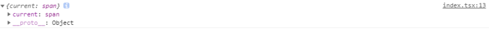

<!-- TOC -->

- [什么是 Hook，为什么要引入 Hook](#什么是-hook为什么要引入-hook)
- [Hook API](#hook-api)
    - [`useState`](#usestate)
        - [和类组件中状态的区别](#和类组件中状态的区别)
        - [注意](#注意)
    - [`useEffect`](#useeffect)
    - [`useReducer`](#usereducer)
    - [`useContext`](#usecontext)
    - [`useCallback`](#usecallback)
    - [`useMemo`](#usememo)
        - [`useMemo`和`useCallback`的区别](#usememo和usecallback的区别)
    - [`useRef`](#useref)
        - [`React.createRef`](#reactcreateref)
        - [`React.forwardRef`](#reactforwardref)
        - [使用`useRef`](#使用useref)
        - [验证`useRef`创建的对象引用是否是固定不变的：](#验证useref创建的对象引用是否是固定不变的)
    - [`useImperativeHandle`](#useimperativehandle)
    - [`useLayoutEffect`](#uselayouteffect)
    - [`useDebugValue`](#usedebugvalue)

<!-- /TOC -->

# 什么是 Hook，为什么要引入 Hook

1. Hook 本质上是一个函数，一般使用`use`开头；
2. 用于增强函数组件的功能，**只能在函数组件中使用**；
3. 可以使开发者无需修改组件结构的情况下复用状态逻辑；
4. 增强函数功能，使开发者无需关心`this`指向问题和复杂的生命周期，写法比类组件容易理解，提高可维护性。

# Hook API

基本常用的是`useState`和`useEffect`。

## `useState`

`useState`可以使函数组件有自己的状态。

- 入参：初始值，不填为`undefined`；
- 出参：返回一个数组，数组的第一项是当前的状态值，第二项是一个方法，用于改变状态的值；
- 运行时间点：每次重新渲染组件时运行。

用法：

```jsx
import React, { Component, useState } from 'react'

export default App(){
    const [count, setCount] = useState(0)

    return (
        <div>
            <button onClick={()=>setCount(count + 1)}>+</button>
            <span>{n}</span>
        </div>
    )
}
```

### 和类组件中状态的区别

1. 类组件中`this.state`必须是一个对象，会将很多逻辑上不相干的数据混在一起；`useState`每调用一次返回一个状态，相互独立，有利于横切关注点；
2. 调用`this.setState`改变数据是将其和原来的数据进行混合，而调用`useState`中改变状态的方法每次都会返回一个新的数据;
3. 和类组件一样，在事件处理函数中使用会合并`setState`，可以使用回调函数的方式解决，`setCount(prevState => prevState + 1)`。

### 注意

1. 在调用`useState`的状态改变方法时，只有在状态和上一次不一样时才会刷新重新调用`render`方法刷新页面；
2. 不要在判断语句中使用`useState`，会导致状态改变不可控。

## `useEffect`

用于处理和当前组件无关的副作用操作，如`dom`元素改变、网络请求、计时器、异步操作等。

- 入参：
  - 第一项：是一个函数，用于放置副作用操作代码；
    - 出参：返回一个清理函数；
      - 清理函数调用时间：
      - 类似`componentDidUnMount`
      - 首次调用`useEffect`不会运行；
      - 后续在每次调用`useEffect`**之前**调用；
      - 组件销毁时运行一次。
  - 第二项：是一个数组，用于放置副作用操作依赖的数据，只要依赖数据发生变化时才会重新运行`useEffect`中的方法；
- 出参：返回一个函数，用于清理副作用；
- 运行时间点：类似`componentDidMount`，但是`componentDidMount`是在组件挂载后立即执行，而`useEffect`是在真实 dom 渲染完成后才运行。

```jsx
import React, { useEffect, useState } from "react";

const ref = React.createRef();
let timer = null;

export default function () {
  const [, forceUpdate] = useState({});

  useEffect(() => {
    console.log("3.副作用函数运行");

    timer = setInterval(() => {
      ref.current.style.width = parseInt(ref.current.style.width) + 10 + "px";
    }, 300);

    return () => {
      console.log("2.清理函数运行");
      clearInterval(timer);
    };
  });

  console.log("1.重新渲染");

  return (
    <div>
      <div
        ref={ref}
        style={{ background: "skyBlue", width: 50, height: 50 }}
      ></div>
      {/* 每次给forceUpdate传入一个空对象，用于强制刷新 */}
      <button onClick={() => forceUpdate({})}>刷新组件</button>
    </div>
  );
}
```

## `useReducer`

用于抽离`reducer`代码，便于重用，不用每次都写`dispatch`方法。

- 入参：
  - 入参 1：传入一个`reducer`;
  - 入参 2：传入初始状态；
  - 参数 3：是一个函数，入参是参数 2 的值，返回值作为初始状态，作用将计算`state`的值提取到组件外部。
- 出参：返回一个数组，数组的第一项是当前仓库，第二项是`dispatch`方法；
- 运行时间点：每次重新渲染组件时运行。

官方例子：

```jsx
import React, { useReducer } from "react";

const initialState = { count: 0 };

function reducer(state, action) {
  switch (action.type) {
    case "increment":
      return { count: state.count + 1 };
    case "decrement":
      return { count: state.count - 1 };
    default:
      throw new Error();
  }
}

function Counter() {
  const [state, dispatch] = useReducer(reducer, initialState);
  return (
    <>
      Count: {state.count}
      <button onClick={() => dispatch({ type: "decrement" })}>-</button>
      <button onClick={() => dispatch({ type: "increment" })}>+</button>
    </>
  );
}
```

可以使用`useState`写一个一样的自定义`hook`。

```jsx
import { useState } from "react";

export default function useReducer(reducer, initialState, initFunc) {
  const [state, setState] = useState(
    initFunc ? initFunc(initialState) : initialState
  );

  function dispatch(action) {
    const newState = reducer(state, action);
    setState(newSate);
  }

  return [state, dispatch];
}
```

`useReducer`就是官方帮我们写好了上述代码，并导出可以直接使用的`hook`。

## `useContext`

讲`useContext`先来复习一下原来的[`context`](https://react.docschina.org/docs/context.html)怎么写。

类组件获取`context`的方式：

```jsx
import React, { Component } from "react";

const Context = React.createContext(); // 使用createContext函数创建一个上下文，参数是默认值，不写为undefined

// 子组件
class Child extends Component {
  static contextType = Context; // 使用上下文

  render() {
    return (
      <div>
        {/* 通过this.context获取上下文中的value，输出I'm a value from context */}
        {this.context}
      </div>
    );
  }
}

// 父组件
export default class Parent extends Component {
  render() {
    return (
      // 使用上下文中的属性Provider给后代组件提供上下文，value是上下文的值
      <Context.Provider value="I'm a value from context">
        <Child />
      </Context.Provider>
    );
  }
}
```

函数组件获取上下文的方式：

```jsx
import React, { Component } from "react";

const Context = React.createContext(); // 使用createContext函数创建一个上下文，参数是默认值，不写为undefined

function Child() {
  return (
    // 通过上下文中的属性Consumer提供value值
    <Context.Consumer>
      {/* 通过函数入参的形式获取上下文中的value值，输出：I'm a value from context*/}
      {(value) => value}
    </Context.Consumer>
  );
}

export default class Parent extends Component {
  render() {
    return (
      // 使用上下文中的属性Provider给后代组件提供上下文，value是上下文的值
      <Context.Provider value="I'm a value from context">
        <Child />
      </Context.Provider>
    );
  }
}
```

再来看看使用`useReducer`改写函数组件获取`context`的方式：

```jsx
import React, { Component, useContext } from "react";

const Context = React.createContext(); // 使用createContext函数创建一个上下文，参数是默认值，不写为undefined

function Child() {
  const value = useContext(Context); //通过useContext获取上下文的值，参数是要使用的上下文对象

  return (
    <div>
      {/* 输出： I'm a value from context*/}
      {value}
    </div>
  );
}

export default class Parent extends Component {
  render() {
    return (
      // 使用上下文中的属性Provider给后代组件提供上下文，value是上下文的值
      <Context.Provider value="I'm a value from context">
        <Child />
      </Context.Provider>
    );
  }
}
```

写起来很爽有木有！！！

1. 不再需要包裹一层不参与显示`<Context.Consumer>`，要知道使用多个`context`是需要嵌套很多层`<Context.Consumer>`的，上面的例子只使用了一个上下文，所有优势没有那么明显，要使用多个上下文就完全不一样了。要使用其它上下文，只需要调用多一次`useContext`获取就好了。
2. 数据不用通过函数方式获取，数据逻辑页面逻辑分开了，调用一个函数就可以获取上下文的值。

> 注：只有函数组件才能使用`hook`，类组件获取`context`的写法不变

## `useCallback`

`useCallback`用于返回一个缓存的函数。函数组件每次重新渲染都是重新运行这个函数，有些函数没有必要重新渲染，可以使用这个`hook`做优化，只有在依赖项改变的时候才会返回一个新的函数。

- 入参：
  - 入参 1: 传入一个想要被缓存的函数
  - 入参 2：依赖项数组
- 出参：返回一个固定引用的函数，只有当依赖性里的数据改变才会返回一个新的函数

举例之前先来说一下`React.memo`，后面的例子会用到。`React.memo`这是一个高阶组件，是给函数组件用的，功能类似于`React.PureComponent`，在渲染之前会对新传入的`props`和之前的`props`进行浅比较，如果没有变化，就不重新渲染。使用方式和高阶组件一样。

```js
function MyComponent(props) {
  /* 使用 props 渲染 */
}

export default React.memo(MyComponent);
```

`useCallback`的使用场景一般是和`React.memo`配合做性能优化。

引出问题，优化前代码：

```jsx
import React, { useState, memo } from "react";

const Child = memo(({ onClick }) => {
  console.log("child render");

  return <button onClick={onClick}>点我啊</button>;
});

export default () => {
  const [number, setNumber] = useState(0);

  const handleClick = () => {
    console.log("我被点了");
  };

  console.log("parent render");
  return (
    <p style={{ textAlign: "center" }}>
       
      <Child onClick={handleClick} />
       
      <input type="number" onChange={(e) => setNumber(e.target.value)} />
          
    </p>
  );
};
```

运行代码执行如下操作：

1. 点击`button`按钮
2. 改变`input`的值

运行效果如下：


分析：

1. 初次渲染没有问题。
2. 点击按钮也没有问题，父组件没有发送状态改变所以不重新渲染，给子组件传入的属性`onClick`自然也没有变化，所以子组件也不会重新渲染。
3. 改变`input`的值，发现父组件和子组件都重新渲染了。父组件状态发生变化，重新渲染是合理的，但是子组件没有必要重新渲染，因为`onClick`实现的功能是一样的。这里就是一个性能优化点。

造成子组件重复渲染的原因是父组件重新渲染，导致传入给子组件的`onClick`引用变了，使用`useCallback`即可解决这个问题。

优化后的代码：

```jsx
import React, { useState, useCallback, memo } from "react";

const Child = memo(({ onClick }) => {
  console.log("child render");

  return <button onClick={onClick}>点我啊</button>;
});

export default () => {
  const [number, setNumber] = useState(0);
  const memoizedCallback = useCallback(() => {
    console.log("我被点了");
  }, []);

  console.log("parent render");
  return (
    <p style={{ textAlign: "center" }}>
            
      <Child onClick={memoizedCallback} />
            
      <input type="number" onChange={(e) => setNumber(e.target.value)} />
          
    </p>
  );
};
```

由于`onClick`被缓存了，父组件刷新后，`memoizedCallback`的引用不变，所以现在再怎么改变`input`的值，子组件都不会刷新了。


## `useMemo`

用于缓存一些需要进行高开销的计算的数据，使之不会在重复渲染中重新计算。如果学过`vue`的话，可以理解为类似`vue`中`computed`里的方法。

- 入参：
  - 入参 1：传入一个用于返回要缓存数的函数
  - 入参 2：依赖项
- 出参：返回缓存后的入参 1 的返回值

优化前代码：

```jsx
import React, { useState } from "react";

export default () => {
  const [number, setNumber] = useState(0);
  const size = 1000;

  let list = [];
  for (let i = 0; i < size; i++) {
    list.push(<li key={i}>{i}</li>);
  }

  return (
    <div style={{ textAlign: "center" }}>
      {list}
      <input
        type="number"
        onChange={(e) => setNumber(e.target.value)}
        value={number}
      />
    </div>
  );
};
```

操作：改变`input`的值三次，使组件重新渲染 3 次。


从上图可以看出，执行 3 次渲染的总耗时为 12.3ms。

使用`useMemo`优化后的代码：

```jsx
import React, { useState, useMemo } from "react";

export default () => {
  const [number, setNumber] = useState(0);
  const size = 1000;

  const list = useMemo(() => {
    let list = [];
    for (let i = 0; i < size; i++) {
      list.push(<li key={i}>{i}</li>);
    }
    return list;
  }, [size]);

  return (
    <div style={{ textAlign: "center" }}>
      {list}
      <input
        type="number"
        onChange={(e) => setNumber(e.target.value)}
        value={number}
      />
    </div>
  );
};
```

执行同样的操作，结果如下：


对比两次结果，很明显，优化后的渲染性能提高了很多。

### `useMemo`和`useCallback`的区别

1. `useCallback`是返回传入的函数体，而`useMemo`是返回传入函数的返回值。
2. `useMemo`的使用范围更广。

使用`useMemo`实现`useCallback`的功能，只需将要返回的值改成需要被缓存函数就行了：

```jsx
const memoizedCallback = useMemo(() => {
  return () => console.log("我被点了");
}, []);
```

`useCallback(fn, deps)`相当于`useMemo(() => fn, deps)`。

## `useRef`

返回一个固定引用的对象。用于在函数组件渲染中共享数据或者保存`dom`节点的值。

- 入参：`current`的初始值(`initialValue`)
- 出参：返回一个固定应用的对象：`{current: initialValue}`

### `React.createRef`

先看看原来的`React.createRef`，`React.createRef`会创建一个对象用来挂载真实的`dom`节点或者保存一个类组件的实例。

```jsx
import React, { createRef, useEffect, Component } from "react";

class Text extends Component {
  render() {
    return <span>text</span>;
  }
}

export default () => {
  const inpRef = createRef();
  const textRef = createRef();

  useEffect(() => {
    // 只有在useEffect中才能获取input和Text的值，因为ref的赋值要等到真实dom渲染之后才执行
    console.log(inpRef);
    console.log(textRef);
  });

  return (
    <div style={{ textAlign: "center" }}>
      {/* 使用ref属性获取input元素 */}
      <input type="number" ref={inpRef} />
      {/* 使用ref属性获取Text类组件实例 */}
      <Text ref={textRef} />
    </div>
  );
};
```

输出：


函数组件是没有实例的，所以不能使用`ref`属性，如果使用会怎么样呢？

```jsx
import React, { createRef, useEffect } from "react";

function Text() {
  return <span>text</span>;
}

export default () => {
  const textRef = createRef();

  useEffect(() => {
    console.log(textRef);
  });

  return (
    <div style={{ textAlign: "center" }}>
      {/* 使用ref属性获取Text函数组件实例 */}
      <Text ref={textRef} />
    </div>
  );
};
```

会报错，并提示你，是不是想使用`React.forwardRef`


### `React.forwardRef`

如果你想获取一个函数组件内部的`dom`节点，就需要使用`React.forwardRef`将`ref`属性进行转发。`React.forwardRef`是个高阶组件，会将`ref`属性通过第二个参数传入到函数组件中。

```jsx
import React, { createRef, useEffect, forwardRef } from "react";

function Text(props, ref) {
  return <span ref={ref}>text</span>;
}

const TextWrapper = forwardRef(Text);

export default () => {
  const textRef = createRef();

  useEffect(() => {
    console.log(textRef);
  });

  return (
    <div style={{ textAlign: "center" }}>
      {/* 使用ref属性获取Text函数组件内部的dom元素 */}
      <TextWrapper ref={textRef} />
    </div>
  );
};
```

输出：


### 使用`useRef`

在获取`dom`元素和组件实例时，`useRef`和`React.forwardRef`的用法差不多。

```jsx
import React, { useEffect, useRef, forwardRef } from "react";

function Text(props, ref) {
  return <span ref={ref}>text</span>;
}

const TextWrapper = forwardRef(Text);

export default () => {
  const textRef = useRef();

  useEffect(() => {
    console.log(textRef);
  });

  return (
    <div style={{ textAlign: "center" }}>
      <TextWrapper ref={textRef} />
    </div>
  );
};
```

输出：


### 验证`useRef`创建的对象引用是否是固定不变的：

假设`useRef`创建的对象每次都是新的，相当于这么写：

```jsx
import React, { useState } from "react";

export default () => {
  const ref = {};
  const [data, setData] = useState();

  console.log(data === ref);

  return <button onClick={() => setData(ref)}>点击将ref的值赋值给data</button>;
};
```

会发现每次都是`false`


但是如果使用`useRef`创建对象：

```
import React, { useRef, useState } from 'react';

export default () => {
  const ref = useRef();
  const [data, setData] = useState();

  console.log(data, ref, data === ref);

  return <button onClick={() => setData(ref)}>点击将ref的值赋值给data</button>;
};
```

会发现点击之后变成了`true`，证明`useRef`的创建的对象引用地址是不变的，可以做数据共享。


## `useImperativeHandle`

当你在父组件中想使用函数子组件的方法时，可以使用`useImperativeHandle`获取。需要和`React.forwardRef`一同使用。

- 入参：
  - 入参 1：`ref`对象
  - 入参 2：函数，返回值作为`ref`对象中`current`属性的值
  - 入参 3：依赖项数组，不填则每次重新渲染都运行

```jsx
import React, { useImperativeHandle, forwardRef, useRef } from "react";

function Text(props, ref) {
  useImperativeHandle(
    ref,
    () => ({
      method() {
        console.log("I am a method from Text");
      },
    }),
    []
  );

  return <div>text</div>;
}

const TextWrapper = forwardRef(Text);

export default () => {
  const textRef = useRef();

  return (
    <div>
      <TextWrapper ref={textRef} />
      <button onClick={() => textRef.current.method()}>
        点我调用子组件的方法
      </button>
    </div>
  );
};
```

点击按钮：


## `useLayoutEffect`

用法和`useEffect`完全一致，只有**执行的时间点不同**，在浏览器绘制页面之前执行，类似类组件的`componentDidMount`、`componentDidUpdate`。

## `useDebugValue`

用于调试的时候显示自定义`hook`信息。需要安装谷歌插件[React Developer Tools](https://chrome.google.com/webstore/detail/react-developer-tools/fmkadmapgofadopljbjfkapdkoienihi?hl=zh-CN&utm_source=chrome-ntp-launcher)。

使用前：

```jsx
import React, { useState } from "react";

// 获取随机数字的自定义hook
function useRandom(min, max) {
  const [number, setNumber] = useState(0);

  const getRandomNumber = () => {
    setNumber(Math.floor(Math.random() * (max - min + 1) + min));
  };

  return [number, getRandomNumber];
}

function App() {
  const [number, getRandomNumber] = useRandom(0, 100);

  return (
    <div style={{ textAlign: "center" }}>
      <p>{number}</p>
      <button onClick={() => getRandomNumber()}>获取随机数字</button>
    </div>
  );
}

export default App;
```


> 调试工具会显示自定义`hook`去掉`use`之后的名字

使用`useDebugValue`

```
import React, { useState, useDebugValue } from "react";

// 获取随机数字的自定义hook
function useRandom(min, max) {
  const [number, setNumber] = useState(0);
  useDebugValue(`获取${min}-${max}的随机值`);
  const getRandomNumber = () => {
    setNumber(Math.floor(Math.random() * (max - min + 1) + min));
  };

  return [number, getRandomNumber];
}

function App() {
  const [number, getRandomNumber] = useRandom(0, 100);

  return (
    <div style={{ textAlign: "center" }}>
      <p>{number}</p>
      <button onClick={() => getRandomNumber()}>获取随机数字</button>
    </div>
  );
}

export default App;
```


`useDebugValue`就是在调试加一个要显示的数据，类似[displayName](https://zh-hans.reactjs.org/docs/react-component.html#displayname)，是用来方便调试查看的。
