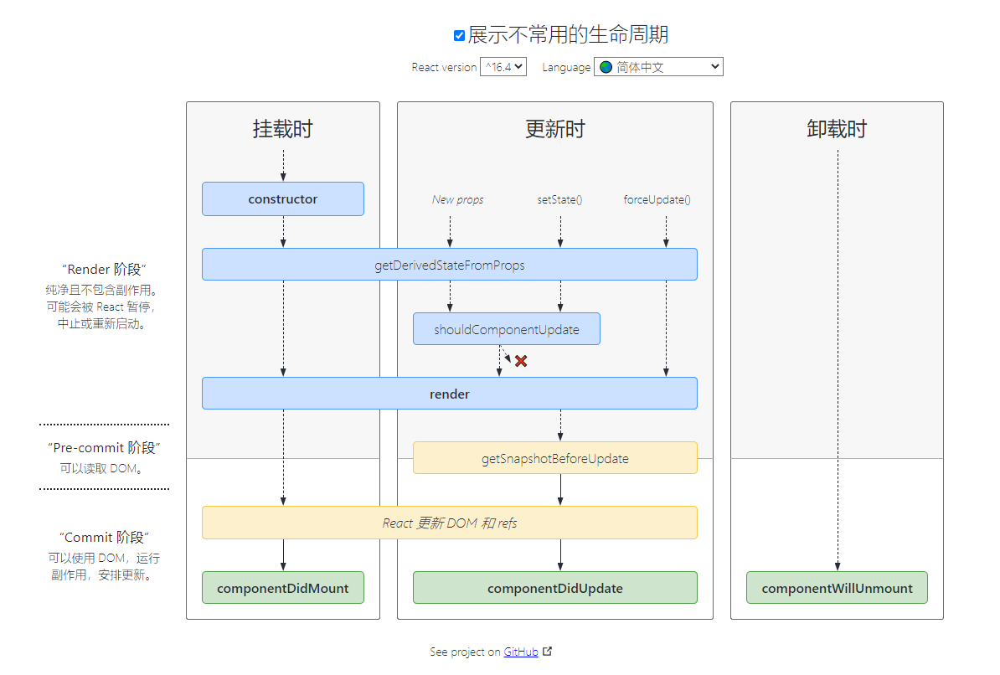

# React常见问题

### React中key是什么，有什么用处？

1. 在React中进行协调的时候，如果新老节点的`key`和`type`都相同，就会复用原来的节点，`key`用来标识节点唯一性，所以当出现相同的`key`时，React会报错。

2. 在更新阶段，如果新老节点的`key`和`type`都相同，就直接更新节点。

3. 比较数组孩子节点，将剩余孩子生成一个`Map`，`key`当做`Map`的`key`，`fiber`当做`Map`的`value`，方便查询比较。

### Refs是什么，有什么用？

Refs提供了一种方式，允许我们访问DOM节点，或在`render`方法中创建React元素。

- 获取类组件实例引用
- 获取DOM节点
- 函数组件无法直接使用`ref`，需要使用`forwardRef`进行转发

### 生命周期

[链接](http://projects.wojtekmaj.pl/react-lifecycle-methods-diagram/)

### 事件系统

React有自己的合成事件，用于处理不同浏览器的兼容性问题。

合成事件使用一个映射表存储。

使用事件委托统一监听事件触发。

### setState

在`setTimeout`和原生事件中是同步的。

在生命周期和合成事件中是异步的。