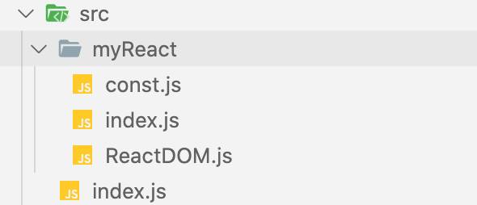
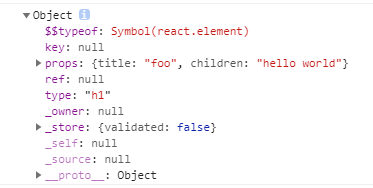
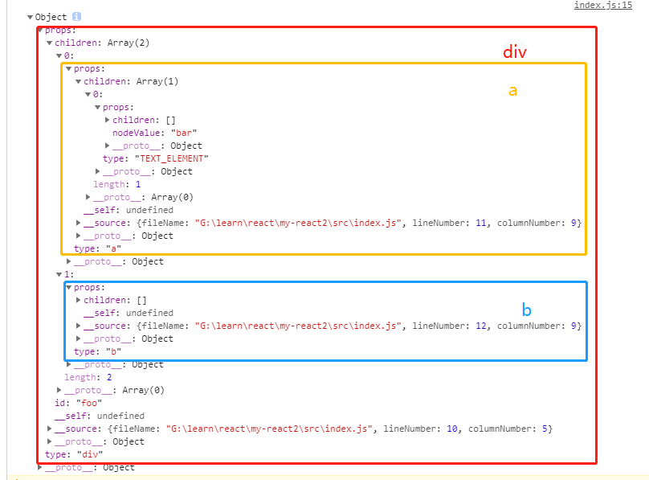
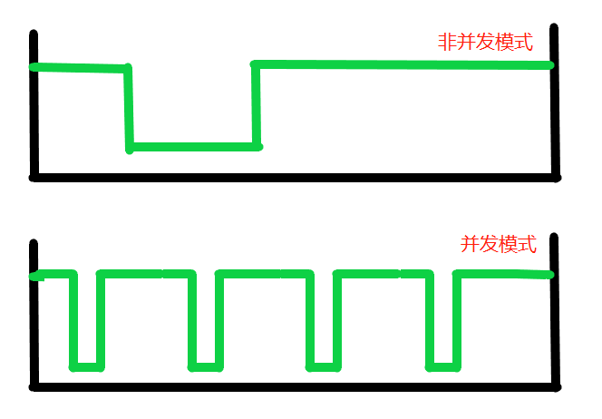
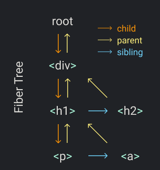
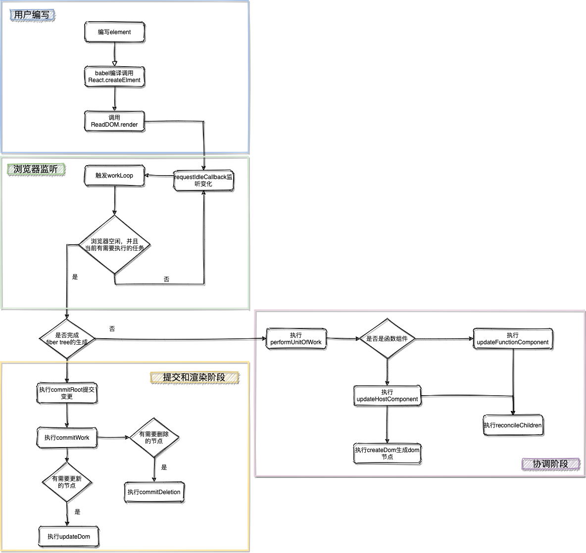

- [文章内容](#文章内容)
- [初始化项目](#初始化项目)
- [step0: 准备工作](#step0-准备工作)
- [step1: 实现`createElement`函数](#step1-实现createelement函数)
- [step2: 实现`render`函数](#step2-实现render函数)
- [step3: 并发模式](#step3-并发模式)
- [step4: 加入Fibers](#step4-加入fibers)
- [step5: 渲染和提交](#step5-渲染和提交)
- [step6: 加入协调算法](#step6-加入协调算法)
- [step7: 加入函数组件渲染支持](#step7-加入函数组件渲染支持)
- [step8: 实现`useState` hook](#step8-实现usestate-hook)
- [后记](#后记)

## 文章内容

仿照源码实现react的初始化渲染和更新功能


**步骤**

- step0: 准备工作

- step1: 实现`createElement`函数

- step2: 实现`render`函数

- step3: 并发模式

- step4: 加入Fibers

- step5: 渲染和提交

- step6: 加入协调算法

- step7: 加入函数组件渲染支持

- step8: 实现`useState`hook

源码地址：https://github.com/wcly/my-react2

目录结构：




## 初始化项目

使用[`create-react-native`](https://www.npmjs.com/package/create-react-app)脚手架创初始化一个项目

运行`npx create-react-native myReact`创建一个项目

在React中使用jsx语法

```js
const element = <h1 title="foo">Hello</h1>
```

babel在编译的时候会转换成

```js
const element = React.createElement("h1", { title: 'foo' }, 'hello world')
```

因此，这就是为什么平时开发的时候，明明没有使用`React`，却要引入，不然就会报错

```js
import React from 'react'
```

然而，在React17中优化这个问题，用户不需用手动导入`react`，它在内部babel编译jsx的时候自动引入，而且在babel转换jsx的时候不再使用`React.createElement`函数，使用的是[`jsx`](https://github.com/reactjs/rfcs/blob/createlement-rfc/text/0000-create-element-changes.md#detailed-design)函数

```js
import {jsx} from "react";

function Foo() {
  return jsx('div', ...);
}
```


**为了保持统一**

如果下载的是React17的版本:point_down:

```json
// package.json
"react": "^17.0.1",
"react-dom": "^17.0.1",
"react-scripts": "4.0.0",
```

需要先运行`yarn eject`命令弹出配置，这个时候babel还是会将jsx转换为`React.createElement`


## step0: 准备工作

[源码](https://github.com/wcly/my-react2/tree/main)

**现在，让我们开始开发一个`React`**

这是原来react的写法

```js
// src\index.js
import React from "react";
import ReactDOM from "react-dom";

const element = <h1 title="foo">Hello</h1>
const container = document.getElementById("root")
ReactDOM.render(element, container)
```

在经过babel转换jxs后

```js
// src\index.js
import React from "react";
import ReactDOM from "react-dom";

const element = React.createElement("h1", { title: 'foo' }, 'hello world')
const container = document.getElementById("root")
ReactDOM.render(element, container)
```

经babel转码jsx后，传递给createElement的第一个参数为type，第二参数为props，剩余参数作为children

打印一下element

```js
console.log(element);
```



**简单的理解，createElement的作用根据用户编写的jsx生成一个虚拟DOM树**

再来看看`ReactDOM.render`方法，这里的render方法，不难看出，这里就是将createElement返回的虚拟DOM树渲染成真实的DOM，并添加到容器root下

下面我们将``ReactDOM.render`方法`换成自己的代码

```js
// src\index.js
import React from 'react'

const element = React.createElement("h1", { title: 'foo' }, 'hello world')

const container = document.getElementById("root")

const node = document.createElement(element.type)
node['title'] = element.props.title
const text = document.createTextNode('')
text['nodeValue'] = element.props.children
node.appendChild(text)
container.appendChild(node)
```


## step1: 实现`createElement`函数

[源码](https://github.com/wcly/my-react2/tree/step1)

实现`createElement的`代码

```js
// src\myReact\index.js
import { TEXT_ELEMENT } from './const'

/**
 * 创建react元素
 * @param {*} type 类型 
 * @param {*} props 属性
 * @param  {...any} children 子节点
 */
function createElement(type, props, ...children) {
    return {
        type,
        props: {
            ...props,
            children: children.map(child =>
                typeof child === 'object'
                    ? child
                    : createTextElement(child)
            ),
        }
    }
}

/**
 * 创建文本元素
 * @param {*} text 文本
 */
function createTextElement(text) {
    return {
        type: TEXT_ELEMENT,
        props: {
            nodeValue: text,
            children: []
        }
    }
}

const React = {
    createElement
}

export default React
```

修改一下我们的例子，使用自己写的`React.createElement`转换jsx

```js
// src\index.js
import React from './myReact'

const element = (
    <div id="foo">
        <a>bar</a>
        <b />
    </div>
)
console.log(element)

const container = document.getElementById("root")

const node = document.createElement(element.type)
node['title'] = element.props.title
const text = document.createTextNode('')
text['nodeValue'] = element.props.children
node.appendChild(text)
container.appendChild(node)
```

打印一下`element`



返回的数据主要关注

```js
{
    type: "div", // 节点类型
    // 属性
    props:{
        id: 'foo', // attr
        children: [...], // 子节点，这里是a标签和b标签
    }
}
```


## step2: 实现`render`函数

[源码](https://github.com/wcly/my-react2/tree/step2)

下面，我们将原来的渲染函数抽出来，加以改造

```js
// src\index.js
import React from './myReact'
import ReactDOM from './myReact/ReactDOM'


const element = (
    <div id="foo">
        <a>bar</a>
        <b />
    </div>
)
console.log(element)

const container = document.getElementById("root")

ReactDOM.render(element, container)
```

实现自己的render函数

```js
// src\myReact\ReactDOM.js
import { TEXT_ELEMENT } from "./const"

/**
 * 渲染函数，将vdom转为dom
 * @param {*} element react元素
 * @param {*} container dom容器
 */
function render(element, container) {
    // 创建dom结点
    const dom = element.type === TEXT_ELEMENT
        ? document.createTextNode('')
        : document.createElement(element.type)

    // 将props分配给结点
    const isProperty = key => key !== 'children'
    Object.keys(element.props)
        .filter(isProperty)
        .forEach(name => {
            dom[name] = element.props[name]
        })

    // 递归遍历子元素
    element.props.children.forEach(child => render(child, dom))

    // 添加子元素
    container.appendChild(dom)
}

const ReactDOM = {
    render
}

export default ReactDOM
```


## step3: 并发模式

[源码](https://github.com/wcly/my-react2/tree/step3)

按找上面的渲染方式，当需要渲染的元素多的时候，在一帧（16.6ms）内无法渲染完毕就会造成浏览器的卡顿。

要想个办法优化，在React中，选择的是把一个大的任务才分成很多小的任务，在浏览器空闲的时候执行每个小的任务。这就是React的**并发模式**。

上图，看图理解👇，占用浏览器的时间被分成了很多小的单元，这样就可以让浏览器优先执行优先级更高的任务（如：用户输入，点击等操作的响应）



:heavy_exclamation_mark:这里使用到一个API：[requestIdleCallback](https://developer.mozilla.org/zh-CN/docs/Web/API/Window/requestIdleCallback#Browser_compatibility)

这个函数会在每次浏览器空闲的时候调用，这个函数接受一个回调函数，函数会接受一个`IdeDeadline`的参数，可以使用`IdeDeadline.timeRemaining()`获取预估的剩余空闲时间毫秒数。

```js
// 下一个浏览器空闲时间要执行的任务
let nextUnitOfWork = null

function workLoop(deadline) {
    let shouldYield = false // 是否阻塞执行任务
    while (nextUnitOfWork && !shouldYield) {
        // 执行任务
        nextUnitOfWork = performUnitOfWork(
            nextUnitOfWork
        )
        // 剩余空闲时间不足一毫秒的时候暂停执行
        shouldYield = deadline.timeRemaining() < 1
    }
    requestIdleCallback(workLoop)
}

// 浏览器处于空闲的时候会调用
requestIdleCallback(workLoop)

function performUnitOfWork(nextUnitOfWork){
    // TODO
}
```


## step4: 加入Fibers

[源码]((https://github.com/wcly/my-react2/tree/step4))

为组织拆分成多个单元的任务，需要一种数据结构，React在这里使用一种叫**Fiber**的数据结构，React给每一个节点分配一个fiber节点，形成fiber树，可以理解为虚拟dom。

**每次执行一个单元的任务就是执行生成一个fiber节点**。

为后续更高效的找到下一个单元的任务，React将fiber的数据结构设计成如下的样子：

- 有一个`parent`，指向自己的父节点
- 有一个`child`，指向自己的第一个孩子节点
- 有一个`sibing`，指向下一个同级的兄弟节点

假设现在要渲染的jsx结构是这样的：

```jsx
React.render(
  <div>
    <h1>
      <p />
      <a />
    </h1>
    <h2 />
  </div>,
  container
)
```

按照我们的例子，生成的fiber树就是下面这个样子的👇



在生成的Fiber树的时候，遵循如下规则：

1. 先找第一个孩子节点，找到则返回
2. 找不到孩子节点，找同级兄弟节点
3. 找不到同级兄弟节点，回父节点，找父节点的兄弟节点
4. 父节点的兄弟节点也没有，再往上找爷爷的兄弟节点
5. 直到找到根节点，就完成本次渲染的所有工作

下面来看看代码怎么写：

首先给`nextUnitOfWork`赋值为渲染的根节点，这样在浏览器空闲的时候就会执行`workLoop`方法👇

```js
// src\myReact\ReactDOM.js
/**
 * 渲染函数
 * @param {*} element react元素
 * @param {*} container dom容器
 */
function render(element, container) {
    // 设置nextUnitOfWork为根fiber结点
    nextUnitOfWork = {
        dom: container,
        props: {
            children: [element],
        }
    }
}

function workLoop(deadline) {
    let shouldYield = false // 是否阻塞执行任务
    while (nextUnitOfWork && !shouldYield) {
        // 执行任务
        nextUnitOfWork = performUnitOfWork(
            nextUnitOfWork
        )
        // 剩余空闲时间不足一毫秒的时候暂停执行
        shouldYield = deadline.timeRemaining() < 1
    }
    requestIdleCallback(workLoop)
}

// 浏览器处于空闲的时候会调用
requestIdleCallback(workLoop)
```

然后再完成`performUnitOfWork`函数👇，分为三步：

1. 根据DOM节点，添加到页面，并使用`fiber.dom`存起来
2. 取出children数组，将每个child转换为fiber结点
3. 返回下一个要渲染的fiber节点

```js
// src\myReact\ReactDOM.js
function performUnitOfWork(fiber) {
    console.log('current render fiber', fiber)
    // 1. 添加dom结点
    if (!fiber.dom) {
        fiber.dom = createDom(fiber)
    }
    if (fiber.parent) {
        fiber.parent.dom.appendChild(fiber.dom)
    }

    // 2. 将每个child转换为fiber结点
    const elements = fiber.props.children
    let index = 0
    let prevSibling = null
    while (index < elements.length) {
        const element = elements[index]
        const newFiber = {
            type: element.type,
            props: element.props,
            parent: fiber,
            dom: null
        }
        // 第一个child结点
        if (index === 0) {
            fiber.child = newFiber
        } else {
            prevSibling.sibling = newFiber
        }

        prevSibling = newFiber
        index++
    }

    // 3. 返回下一个要渲染的fiber结点
    // 找child结点
    if (fiber.child) {
        return fiber.child
    }
    let nextFiber = fiber
    while (nextFiber) {
        // 找兄弟结点
        if (nextFiber.sibling) {
            return nextFiber.sibling
        }
        // 往父节点找
        nextFiber = nextFiber.parent
    }
}
```

`console.log('current render fiber', fiber)`打印结果如下：


> 补充：`createDom`函数

```js
// src\myReact\ReactDOM.js
/**
 * 将fiber结点转换为真实DOM结点
 * @param {*} fiber fiber结点
 */
function createDom(fiber) {
    const dom =
        fiber.type === TEXT_ELEMENT
            ? document.createTextNode("")
            : document.createElement(fiber.type)

    const isProperty = key => key !== "children"
    Object.keys(fiber.props)
        .filter(isProperty)
        .forEach(name => {
            dom[name] = fiber.props[name]
        })

    return dom
}
```

最后再来回顾一下完整的**fiber**的结构

```js
{
	parent: null, //父节点
	sibling: null, // 下一个兄弟节点
	child: null, // 第一子节点
	dom： null, // 真实dom节点
	type: null, // 节点类型
	props: null, // 属性
}
```


## step5: 渲染和提交

[源码]((https://github.com/wcly/my-react2/tree/step5))

上面的代码有一个问题:bug:，每次生成一个fiber结点的时候就马上渲染到页面上，但是浏览器可能会在途中打断这个操作，用户就会看到不完整的页面。

现在要解决这个问题，需要将渲染的逻辑提取出来，和fiber tree的生成独立开来：

-  我们用一个变量记录`wipRoot`（work in progress root）记录工作中的fiber，以便在浏览器打断之后从该结点起继续工作
- 将原来的渲染的逻辑去掉

- 在整个fiber tree生成后进行提交操作，然后完成渲染操作

代码如下👇：

```js
// src\myReact\ReactDOM.js
import { TEXT_ELEMENT } from "./const"

let nextUnitOfWork = null // 下一个浏览器空闲时间要执行的任务
let wipRoot = null // 用于记录工作过程中的根节点

/**
 * 将fiber结点装换为真实DOM结点
 * @param {*} fiber fiber结点
 */
function createDom(fiber) {
    const dom =
        fiber.type === TEXT_ELEMENT
            ? document.createTextNode("")
            : document.createElement(fiber.type)

    const isProperty = key => key !== "children"
    Object.keys(fiber.props)
        .filter(isProperty)
        .forEach(name => {
            dom[name] = fiber.props[name]
        })

    return dom
}

/**
 * 提交
 */
function commitRoot(){
    commitWork(wipRoot.child)
    wipRoot = null
}

/**
 * 递归渲染dom树
 * @param {*} fiber fiber结点
 */
function commitWork(fiber){
    if(!fiber){
        return
    }
    const domParent = fiber.parent.dom
    domParent.appendChild(fiber.dom)
    commitWork(fiber.child)
    commitWork(fiber.sibling)
}

/**
 * 渲染函数，将vdom转为dom
 * @param {*} element react元素
 * @param {*} container dom容器
 */
function render(element, container) {
    // 根fiber结点
    wipRoot = {
        dom: container,
        props: {
            children: [element],
        }
    }
    // 从根结点开始工作
    nextUnitOfWork = wipRoot
}

function workLoop(deadline) {
    let shouldYield = false // 是否阻塞执行任务
    while (nextUnitOfWork && !shouldYield) {
        // 执行任务
        nextUnitOfWork = performUnitOfWork(
            nextUnitOfWork
        )
        // 剩余空闲时间不足一毫秒的时候暂停执行
        shouldYield = deadline.timeRemaining() < 1
    }

    // 生成整个fiber tree之后提交给DOM
    if(!nextUnitOfWork && wipRoot){
        commitRoot()
    }

    requestIdleCallback(workLoop)
}

// 浏览器处于空闲的时候会调用
requestIdleCallback(workLoop)

function performUnitOfWork(fiber) {
    // 1. 添加dom结点
    if (!fiber.dom) {
        fiber.dom = createDom(fiber)
    }
    if (fiber.parent) {
        fiber.parent.dom.appendChild(fiber.dom)
    }

    // 2. 将每个child转换为fiber结点
    const elements = fiber.props.children
    let index = 0
    let prevSibling = null
    while (index < elements.length) {
        const element = elements[index]
        const newFiber = {
            type: element.type,
            props: element.props,
            parent: fiber,
            dom: null
        }
        // 第一个child结点
        if (index === 0) {
            fiber.child = newFiber
        } else {
            prevSibling.sibling = newFiber
        }

        prevSibling = newFiber
        index++
    }

    // 3. 返回下一个要生成的fiber结点
    // 找child结点
    if (fiber.child) {
        return fiber.child
    }
    let nextFiber = fiber
    while (nextFiber) {
        // 找兄弟结点
        if (nextFiber.sibling) {
            return nextFiber.sibling
        }
        // 往父节点找
        nextFiber = nextFiber.parent
    }
}

const ReactDOM = {
    render
}

export default ReactDOM
```


## step6: 加入协调算法

[源码]((https://github.com/wcly/my-react2/tree/step6))

到目前为止，我们只完成了页面的元素的添加工作，还有更新和删除工作没有做。在React中，这一步称之为**协调**，可以理解为虚拟DOM的diff算法。

下面将是我们要做的事👇：

- 首先，我们需要比较上一次提交的fiber tree和这次render中传入的elements，所以我们需要一个变量存储上一次提交的fiber tree，这里使用的是`currentRoot`
- 其次，我们还需要为每个fiber结点添加一个新的属性`alternate`，用于连接旧的fiber结点
- 然后，我们将创建新fiber树的代码从`performUnitOfWork`中抽离出来
- 添加`recnocileChildren`方法，用于比较新老fiber并进行更新操作


`recnocileChildren`的具体比较逻辑👇：

这里要明确两个变量，`element`：代表将要渲染的结点，`oldRiber`：代表上一次渲染的结点

- 如果old fiber和new elemnt有相同的type，我们保留原来的DOM结点，并只更新它的属性
- 如果type不一样然后有new element，这代表我们需要创建一个新的DOM节点
- 如果type不同然后有old fiber，代表需要移除这个旧的节点

> 在React原码中，为了进行更好的协调工作，还使用了keys。例如：用于检测子元素在元素数组中的位置变化


为标记不同状态，这里还要在fiber节点中加入一个新的属性：`efffectTag`，该属性具有以下三种类型：

- `UPDATE`：更新
- `PLACEMENT`：新增
- `DELETION`：删除

对于删除，我们需要添加一个数组用于记录需要移除的节点，等到render阶段进行移除，这里使用`deletions`记录。


另外，我们还加入对事件的支持。


完整代码👇：

```js
// src\myReact\ReactDOM.js
import { EFFECT_TAG_UPDATE, TEXT_ELEMENT, EFFECT_TAG_PLACEMENT, EFFECT_TAG_DELETION } from "./const"

let nextUnitOfWork = null // 下一个浏览器空闲时间要执行的任务
let wipRoot = null // 用于记录工作过程中的根节点
let currentRoot = null // 上一个提交的fiber根节点
let deletions = null // 需要删除的fiber结点

// 是不是事件
const isEvent = key => key.startsWith('on')
// 是不是属性
const isProperty = key => key !== "children" && !isEvent(key)
// 是不是新属性
const isNew = (prev, next) => key =>
    prev[key] !== next[key]
// 是不是旧属性
const isGone = (prev, next) => key => !(key in next)

/**
 * 将fiber结点装换为真实DOM结点
 * @param {*} fiber fiber结点
 */
function createDom(fiber) {
    const dom =
        fiber.type === TEXT_ELEMENT
            ? document.createTextNode("")
            : document.createElement(fiber.type)

    updateDom(dom, {}, fiber.props);

    return dom
}

function commitRoot() {
    deletions.forEach(commitWork)
    commitWork(wipRoot.child)
    currentRoot = wipRoot
    wipRoot = null
}

/**
 * 递归渲染dom树
 * @param {*} fiber fiber结点
 */
function commitWork(fiber) {
    if (!fiber) {
        return
    }
    const domParent = fiber.parent.dom
    if (
        fiber.effectTag === EFFECT_TAG_PLACEMENT &&
        fiber.dom !== null
    ) {
        // 插入DOM结点
        domParent.appendChild(fiber.dom)
    } else if (fiber.effectTag === EFFECT_TAG_DELETION) {
        // 删除DOM结点
        domParent.removeChild(fiber.dom)
    } else if (
        fiber.effectTag === EFFECT_TAG_UPDATE &&
        fiber.dom !== null
    ) {
        // 更新DOM节点
        updateDom(
            fiber.dom,
            fiber.alternate.props,
            fiber.props
        )
    }
    commitWork(fiber.child)
    commitWork(fiber.sibling)
}

/**
 * 更新dom结点
 * @param {*} dom 需要更新的dom结点 
 * @param {*} prevProps 旧的属性
 * @param {*} nextProps 新的属性
 */
function updateDom(dom, prevProps, nextProps) {
    // 移除旧的事件监听
    Object.keys(prevProps)
        .filter(isEvent)
        .filter(
            key =>
                !(key in nextProps) ||
                isNew(prevProps, nextProps)(key)
        )
        .forEach(name => {
            const eventType = name
                .toLocaleLowerCase()
                .substring(2)
            dom.removeEventListener(
                eventType,
                prevProps[name]
            )
        })
    // 移除旧属性
    Object.keys(prevProps)
        .filter(isProperty)
        .filter(isGone(prevProps, nextProps))
        .forEach(name => {
            dom[name] = ''
        })
    // 设置新的属性或更新属性
    Object.keys(nextProps)
        .filter(isProperty)
        .filter(isNew(prevProps, nextProps))
        .forEach(name => {
            dom[name] = nextProps[name]
        })
    // 添加新的事件
    Object.keys(nextProps)
        .filter(isEvent)
        .filter(isNew(prevProps, nextProps))
        .forEach(name => {
            const eventType = name
                .toLocaleLowerCase()
                .substring(2)
            dom.addEventListener(
                eventType,
                nextProps[name]
            )
        })
}

/**
 * 渲染函数，将vdom转为dom
 * @param {*} element react元素
 * @param {*} container dom容器
 */
function render(element, container) {
    // 根fiber结点
    wipRoot = {
        dom: container,
        props: {
            children: [element],
        },
        alternate: currentRoot, // 记录上一次更新到dom的fiber结点
    }
    deletions = [] // 初始化删除结点数组
    // 从根结点开始工作
    nextUnitOfWork = wipRoot
}

function workLoop(deadline) {
    let shouldYield = false // 是否阻塞执行任务
    while (nextUnitOfWork && !shouldYield) {
        // 执行任务
        nextUnitOfWork = performUnitOfWork(
            nextUnitOfWork
        )
        // 剩余空闲时间不足一毫秒的时候暂停执行
        shouldYield = deadline.timeRemaining() < 1
    }

    // 生成整个fiber tree之后提交给DOM
    if (!nextUnitOfWork && wipRoot) {
        commitRoot()
    }

    requestIdleCallback(workLoop)
}

// 浏览器处于空闲的时候会调用
requestIdleCallback(workLoop)

function performUnitOfWork(fiber) {
    // 1. 添加dom结点
    if (!fiber.dom) {
        fiber.dom = createDom(fiber)
    }

    // 2. 将每个child转换为fiber结点
    const elements = fiber.props.children
    reconcileChildren(fiber, elements)

    // 3. 返回下一个要生成的fiber结点
    // 找child结点
    if (fiber.child) {
        return fiber.child
    }
    let nextFiber = fiber
    while (nextFiber) {
        // 找兄弟结点
        if (nextFiber.sibling) {
            return nextFiber.sibling
        }
        // 往父节点找
        nextFiber = nextFiber.parent
    }
}

/**
 * 协调算法
 * @param {*} wipFiber 当前工作中的fiber结点
 * @param {*} elements 当前fiber的子元素
 */
function reconcileChildren(wipFiber, elements) {
    let index = 0
    // 老结点
    let oldFiber = wipFiber.alternate && wipFiber.alternate.child
    let prevSibing = null
    while (
        index < elements.length ||
        oldFiber
    ) {
        const element = elements[index]
        let newFiber = null

        const sameType =
            oldFiber &&
            element &&
            element.type === oldFiber.type

        if (sameType) {
            // 更新结点
            newFiber = {
                type: oldFiber.type,
                props: element.props,
                dom: oldFiber.dom,
                parent: wipFiber,
                alternate: oldFiber,
                effectTag: EFFECT_TAG_UPDATE
            }
        }
        if (element && !sameType) {
            // 添加节点
            newFiber = {
                type: element.type,
                props: element.props,
                dom: null,
                parent: wipFiber,
                alternate: null,
                effectTag: EFFECT_TAG_PLACEMENT
            }
        }
        if (oldFiber && !sameType) {
            // 删除结点
            oldFiber.effectTag = EFFECT_TAG_DELETION
            deletions.push(oldFiber)
        }

        if (oldFiber) {
            oldFiber = oldFiber.sibling
        }

        if (index === 0) {
            wipFiber.child = newFiber
        } else if (element) {
            prevSibing.sibling = newFiber
        }

        prevSibing = newFiber
        index++
    }
}

const ReactDOM = {
    render
}

export default ReactDOM
```

新fiber结点的数据结构：

```js
{
	parent: null, //父节点
	sibling: null, // 下一个兄弟节点
	child: null, // 第一子节点
	dom： null, // 真实dom节点
	type: null, // 节点类型
	props: null, // 属性
	alternate: null, // 老的fiber结点
}
```


## step7: 加入函数组件渲染支持

[源码]((https://github.com/wcly/my-react2/tree/step7))

下面，我们要加入函数组件的渲染支持。

先修改一下我们的例子：

```js
// src\index.js
import React from './myReact'
import ReactDOM from './myReact/ReactDOM'

function App(props) {
    return <h1>Hi {props.name}</h1>
}
const element = <App name="foo" />
const container = document.getElementById("root")
ReactDOM.render(element, container)
```


函数组件和普通结点有两点不同

- 来自函数组件的fiber没有DOM结点
- children是来自函数组件的运行结果而不是直接从props中获取


我们用type的类型来判断是不是函数组件，并创建一个`updateFunctionComponent`用于更新函数组件，用`updateHostComponent`更新普通节点。

还有一点需要注意的是，函数组件没有带dom属性，需要找到有dom属性的节点进行新增和删除操作。


完整代码如下：

```js
// src\myReact\ReactDOM.js
import { EFFECT_TAG_UPDATE, TEXT_ELEMENT, EFFECT_TAG_PLACEMENT, EFFECT_TAG_DELETION } from "./const"

let nextUnitOfWork = null // 下一个浏览器空闲时间要执行的任务
let wipRoot = null // 用于记录工作过程中的根节点
let currentRoot = null // 上一个提交的fiber根节点
let deletions = null // 需要删除的fiber结点

// 是不是事件
const isEvent = key => key.startsWith('on')
// 是不是属性
const isProperty = key => key !== "children" && !isEvent(key)
// 是不是新属性
const isNew = (prev, next) => key =>
    prev[key] !== next[key]
// 是不是旧属性
const isGone = (prev, next) => key => !(key in next)

/**
 * 将fiber结点装换为真实DOM结点
 * @param {*} fiber fiber结点
 */
function createDom(fiber) {
    const dom =
        fiber.type === TEXT_ELEMENT
            ? document.createTextNode("")
            : document.createElement(fiber.type)

    updateDom(dom, {}, fiber.props);

    return dom
}

function commitRoot() {
    deletions.forEach(commitWork)
    commitWork(wipRoot.child)
    currentRoot = wipRoot
    wipRoot = null
}

/**
 * 递归渲染dom树
 * @param {*} fiber fiber结点
 */
function commitWork(fiber) {
    if (!fiber) {
        return
    }
    let domParentFiber = fiber.parent
    // 有些结点可能没有dom结点（函数结点），往上找到有dom的节点
    while (!domParentFiber.dom) {
        domParentFiber = domParentFiber.parent
    }
    const domParent = domParentFiber.dom
    if (
        fiber.effectTag === EFFECT_TAG_PLACEMENT &&
        fiber.dom !== null
    ) {
        // 插入DOM结点
        domParent.appendChild(fiber.dom)
    } else if (fiber.effectTag === EFFECT_TAG_DELETION) {
        // 删除DOM结点
        commitDeletion(fiber, domParent)
    } else if (
        fiber.effectTag === EFFECT_TAG_UPDATE &&
        fiber.dom !== null
    ) {
        // 更新DOM节点
        updateDom(
            fiber.dom,
            fiber.alternate.props,
            fiber.props
        )
    }
    commitWork(fiber.child)
    commitWork(fiber.sibling)
}

/**
 * 删除dom结点
 * @param {*} fiber fiber结点
 * @param {*} domParent dom父节点
 */
function commitDeletion(fiber, domParent) {
    // 往下找，找到有dom结点的时候删除
    if (fiber.dom) {
        domParent.removeChild(fiber.dom)
    } else {
        commitDeletion(fiber.child, domParent)
    }
}

/**
 * 更新dom结点
 * @param {*} dom 需要更新的dom结点 
 * @param {*} prevProps 旧的属性
 * @param {*} nextProps 新的属性
 */
function updateDom(dom, prevProps, nextProps) {
    // 移除旧的事件监听
    Object.keys(prevProps)
        .filter(isEvent)
        .filter(
            key =>
                !(key in nextProps) ||
                isNew(prevProps, nextProps)(key)
        )
        .forEach(name => {
            const eventType = name
                .toLocaleLowerCase()
                .substring(2)
            dom.removeEventListener(
                eventType,
                prevProps[name]
            )
        })
    // 移除旧属性
    Object.keys(prevProps)
        .filter(isProperty)
        .filter(isGone(prevProps, nextProps))
        .forEach(name => {
            dom[name] = ''
        })
    // 设置新的属性或更新属性
    Object.keys(nextProps)
        .filter(isProperty)
        .filter(isNew(prevProps, nextProps))
        .forEach(name => {
            dom[name] = nextProps[name]
        })
    // 添加新的事件
    Object.keys(nextProps)
        .filter(isEvent)
        .filter(isNew(prevProps, nextProps))
        .forEach(name => {
            const eventType = name
                .toLocaleLowerCase()
                .substring(2)
            dom.addEventListener(
                eventType,
                nextProps[name]
            )
        })
}

/**
 * 渲染函数，将vdom转为dom
 * @param {*} element react元素
 * @param {*} container dom容器
 */
function render(element, container) {
    // 根fiber结点
    wipRoot = {
        dom: container,
        props: {
            children: [element],
        },
        alternate: currentRoot, // 记录上一次更新到dom的fiber结点
    }
    deletions = [] // 初始化删除结点数组
    // 从根结点开始工作
    nextUnitOfWork = wipRoot
}

function workLoop(deadline) {
    let shouldYield = false // 是否阻塞执行任务
    while (nextUnitOfWork && !shouldYield) {
        // 执行任务
        nextUnitOfWork = performUnitOfWork(
            nextUnitOfWork
        )
        // 剩余空闲时间不足一毫秒的时候暂停执行
        shouldYield = deadline.timeRemaining() < 1
    }

    // 生成整个fiber tree之后提交给DOM
    if (!nextUnitOfWork && wipRoot) {
        commitRoot()
    }

    requestIdleCallback(workLoop)
}

// 浏览器处于空闲的时候会调用
requestIdleCallback(workLoop)

function performUnitOfWork(fiber) {
    // 生成fiber结点
    const isFunctionComponent = fiber.type instanceof Function
    if (isFunctionComponent) {
        updateFunctionComponent(fiber)
    } else {
        updateHostComponent(fiber)
    }

    // 返回下一个要生成的fiber结点
    // 找child结点
    if (fiber.child) {
        return fiber.child
    }
    let nextFiber = fiber
    while (nextFiber) {
        // 找兄弟结点
        if (nextFiber.sibling) {
            return nextFiber.sibling
        }
        // 往父节点找
        nextFiber = nextFiber.parent
    }
}

/**
 * 渲染函数组件
 * @param {*} fiber fiber结点
 */
function updateFunctionComponent(fiber) {
    const children = [fiber.type(fiber.props)]
    reconcileChildren(fiber, children)
}

/**
 * 渲染宿主结点
 * @param {*} fiber fiber结点
 */
function updateHostComponent(fiber) {
    if (!fiber.dom) {
        fiber.dom = createDom(fiber)
    }
    reconcileChildren(fiber, fiber.props.children)
}

/**
 * 协调算法
 * @param {*} wipFiber 当前工作中的fiber结点
 * @param {*} elements 当前fiber的子元素
 */
function reconcileChildren(wipFiber, elements) {
    let index = 0
    // 老结点
    let oldFiber = wipFiber.alternate && wipFiber.alternate.child
    let prevSibing = null
    while (
        index < elements.length ||
        oldFiber
    ) {
        const element = elements[index]
        let newFiber = null

        const sameType =
            oldFiber &&
            element &&
            element.type === oldFiber.type

        if (sameType) {
            // 更新结点
            newFiber = {
                type: oldFiber.type,
                props: element.props,
                dom: oldFiber.dom,
                parent: wipFiber,
                alternate: oldFiber,
                effectTag: EFFECT_TAG_UPDATE
            }
        }
        if (element && !sameType) {
            // 添加节点
            newFiber = {
                type: element.type,
                props: element.props,
                dom: null,
                parent: wipFiber,
                alternate: null,
                effectTag: EFFECT_TAG_PLACEMENT
            }
        }
        if (oldFiber && !sameType) {
            // 删除结点
            oldFiber.effectTag = EFFECT_TAG_DELETION
            deletions.push(oldFiber)
        }

        if (oldFiber) {
            oldFiber = oldFiber.sibling
        }

        if (index === 0) {
            wipFiber.child = newFiber
        } else if (element) {
            prevSibing.sibling = newFiber
        }

        prevSibing = newFiber
        index++
    }
}

const ReactDOM = {
    render
}

export default ReactDOM
```


## step8: 实现`useState` hook

[源码]((https://github.com/wcly/my-react2/tree/step8))

为体现hook功能，再改一下我们的例子，加入useState:

```js
// src\index.js
import React, { useState } from './myReact'
import ReactDOM from './myReact/ReactDOM'

function Counter() {
    const [state, setState] = useState(1)
    return (
        <h1 onClick={() => setState(c => c + 1)}>
            Count: {state}
        </h1>
    )
}

const element = <Counter />
const container = document.getElementById("root")
ReactDOM.render(element, container)
```


现在我们来看看如何实现：

给fiber加一个属性`hooks`，用于存放hooks，因为一个组件可能有多个hooks，所以是个数组。

添加一个全局属性`hookIndex`，记录hook的索引。

在渲染函数组件的时候初始化hooks和hookIndex

```js
// src\myReact\ReactDOM.js
let hookIndex = null // hook索引
/**
 * 渲染函数组件
 * @param {*} fiber fiber结点
 */
function updateFunctionComponent(fiber) {
    wipFiber = fiber
    hookIndex = 0
    wipFiber.hooks = []
    const children = [fiber.type(fiber.props)]
    reconcileChildren(fiber, children)
}
```


useState实现代码如下：

```js
// src\myReact\ReactDOM.js
export function useState(initial) {
    const oldHook =
        wipFiber.alternate &&
        wipFiber.alternate.hooks &&
        wipFiber.alternate.hooks[hookIndex]
    const hook = {
        state: oldHook ? oldHook.state : initial, // 有旧的hook就取旧hook的state，没有就使用用户传入的初始值
        queue: []
    }

    // 模拟多次触发setState
    const actions = oldHook ? oldHook.queue : []
    actions.forEach(action => {
        hook.state = action(hook.state)
    })

    const setState = action => {
        hook.queue.push(action)
        // state更新，重新设置wipRoot的值，触发更新
        wipRoot = {
            dom: currentRoot.dom,
            props: currentRoot.props,
            alternate: currentRoot
        }
        nextUnitOfWork = wipRoot
        deletions = []
    }

    // 每次调用一次useState，入栈一个hook，索引加1
    wipFiber.hooks.push(hook)
    hookIndex++

    return [hook.state, setState]
}
```


## 后记

来一张整体的函数调用流程图:smiley:：



好了，现在我们就完成一个简单的react库 :tada::tada::tada:

现在我们和真实的React做个对比：

- 我们在渲染阶段遍历整棵树，而在React中，会利用启发式算法，跳过没有变化的子树
- 我们在提交阶段也遍历整颗树，React则使用一个链表，只保留和访问有变动的fiber结点
- 我们每次在创建fiber树的时候，都会为每个fiber结点创建一个新的对象，React会从之前的fiber树中回收再利用
- 我们每次更新的时候都会丢弃当前正在工作的树，重新从根节点开始遍历，React会使用过期时间戳标记每次更新，然后使用它来决定哪个更新有更高的优先级
- 等等...


**参考：**

> https://pomb.us/build-your-own-react/
>
> https://react.iamkasong.com/

