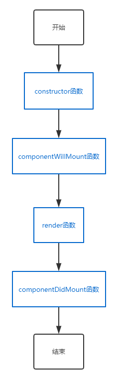
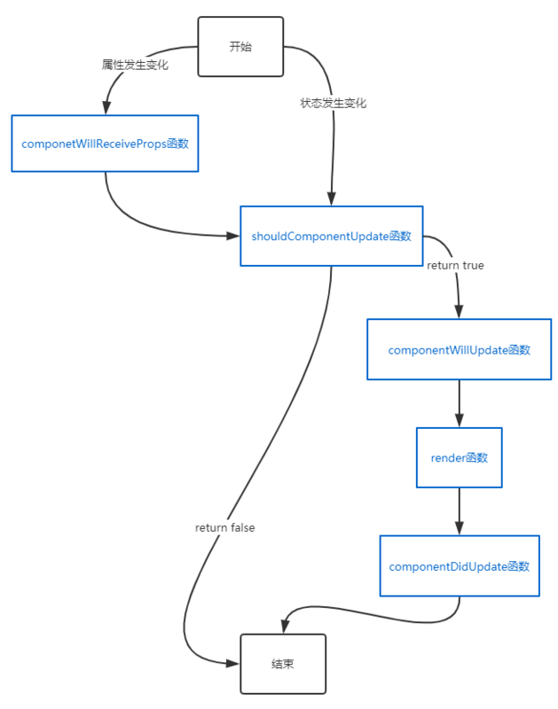

### 什么是生命周期？

生命周期是一个组件从创建到销毁的过程。`react`会在不同的时间点注入相应的钩子函数，以便于开发者进行更灵活的数据处理。

> 生命周期只存在于类组件中，函数组件没有生命周期。但是在后来的新版本`react`提供了`hook`用于管理函数组件的状态。

### 生命周期分三个阶段

1. 初始化阶段；
2. 更新阶段;
3. 销毁阶段。

#### 初始化阶段：



1. `constructor(props)`函数：
    - 只会执行一次，用于初始化数据；
    - 无法使用`setState`，页面还未挂载。
2. `componentWillMount`函数：
    - 挂载数据之前执行，只会执行一次；
    - 可以使用`setState`,但是很容易导致bug，不建议在这里使用；
    - **新版的react已经移除该钩子函数。**
3. `render`函数：
    - 每次渲染都会运行；
    - 将返回数据挂载在虚拟dom中，然后会构建真实的dom渲染页面；
    - 不能调用`setState`方法，会造成无限递归内存泄露。
4. `componentDidMount`函数：
    - 挂载完成阶段，可以在这里开启定时器，发送ajax请求业务数据等。

#### 更新阶段：属性（props）发生变化或者状态（state）发生变化



1. `componentWillReceiveProps(nextProps)`函数：
    - 接受新的属性值；
    - 使用该函数很容易导致一些bug，不建议使用。
    - **新版的react已经移除该钩子函数。**
2. `shouldComponentUpdate(nextProps, nextState)`函数：
    - 必须返回一个布尔值，返回`true`执行`render`函数，返回`false`不执行`render`函数;
    - 用于减少不必要的渲染，做页面性能优化。
3. `componentWillUpdate(nextProps, nextState)`函数：
    - 组件即将被重新渲染；
    - **新版的react已经移除该钩子函数。**
4. `componentDidUpdate(prevProps, prevState, snapshot)`函数：
    - 有时会在该函数中操作真实dom元素。

#### 销毁阶段：

1. `componentWillUnmount()`函数：
    - 只执行一次，在组件销毁前执行；
    - 通常在该函数中做一些清理计时器，中断请求的事情。

### 新版生命周期（16.3以上版本）
[官方图解](http://projects.wojtekmaj.pl/react-lifecycle-methods-diagram/)已经画的很清楚了，这里不在赘述，主要说一下区别。

#### 移除钩子函数
1. `componentWillMount`函数
    - 有一些bug难以解决，所以被移除。
2. `componentWillReceiveProps`函数
    - 防止用户滥用，导致数据来源混乱不可控，类似[手表定律](https://baike.baidu.com/item/%E6%89%8B%E8%A1%A8%E5%AE%9A%E5%BE%8B/4307956?fr=aladdin)。**一个页面的值要么来自属性要么来自状态，必须是单一的**，否则是一种反模式的写法，容易造成bug。
3. `componentWillUpdate`函数
    - 使用场景不多，所以被移除。

#### 新增钩子函数
1. `getDerivedStateFromProps(props, state)`函数
    - 是一个静态函数，使用是要加`static`关键字；
    - 在render之前调用；
    - 返回的值替换原来的state，返回null不改变state的值；
    - 多用于受控组件编写。
2. `getSnapshotBeforeUpdate(prevProps, prevState)`函数
    - 真实的dom发生改变，但是还没渲染到页面中，可以进行一些dom操作；
    - 通常和`componentDidUpdate(prevProps, prevState, snapshot)`连用，返回的值作为该函数的第三个参数传入。

### setState是异步的吗？
1. **可能**是异步的，当`setSate`在dom事件处理函数中调用时就是异步的；
2. 异步会导致当前的状态更新不准确的问题。

举个例子:

```jsx
import React, {Component} from 'react'

export default class index extends Component{
    state = {
        count: 0
    }
    
    //点击一次count加2
    hanldeClick = () => {
        this.setState({
            count: this.state.count + 1
        })
        this.setState({
            count: this.state.count + 1
        })
    }
    
    render(){
        return (
            <div onClick={this.hanldeClick}>{this.state.count}</div>
        )
    }
}
```

根据上述代码，在点击`div`之后，按道理，`count`的值应该变成`2`，但实际显示的确是`1`。

解决办法：给`setState`传入一个函数更新数据。

```jsx
//点击一次count加2
hanldeClick = () => {
    //使用这种方式获取的上一个state是最新的
    this.setState(function(state, props) {
        return {
            count: state.count + 2
        };
    })
}
```

##### 为什么会造成这种现象？
react团队觉得，dom事件处理函数中状态处理会比较复杂，`setState`的次数比较多，如果每次`setState`就去更新页面，会影响页面渲染效率，所以会将事件中的多个`setState`合并成同一个。