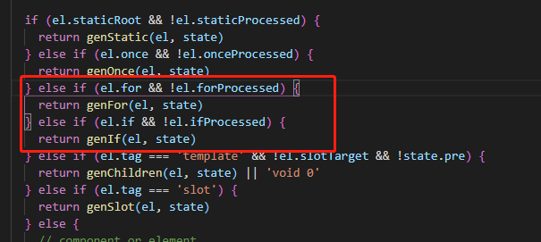
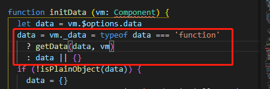
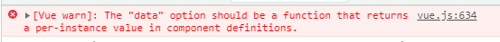
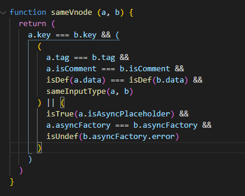
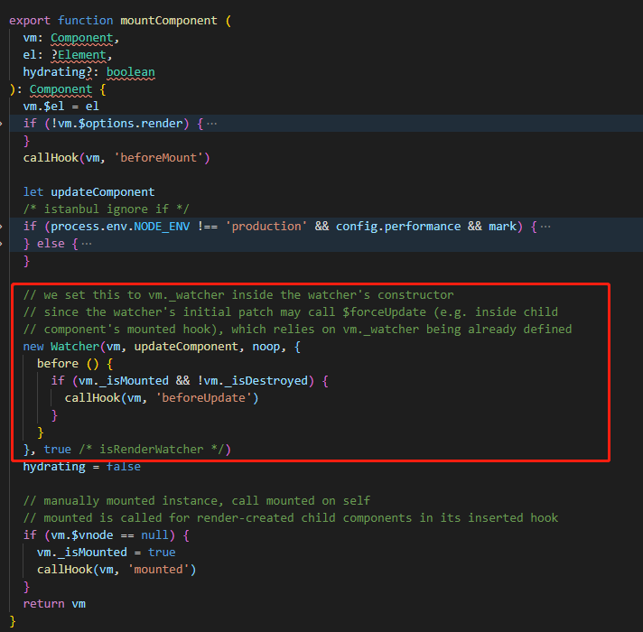
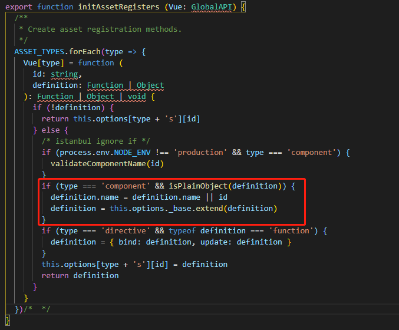
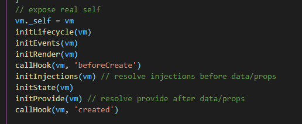
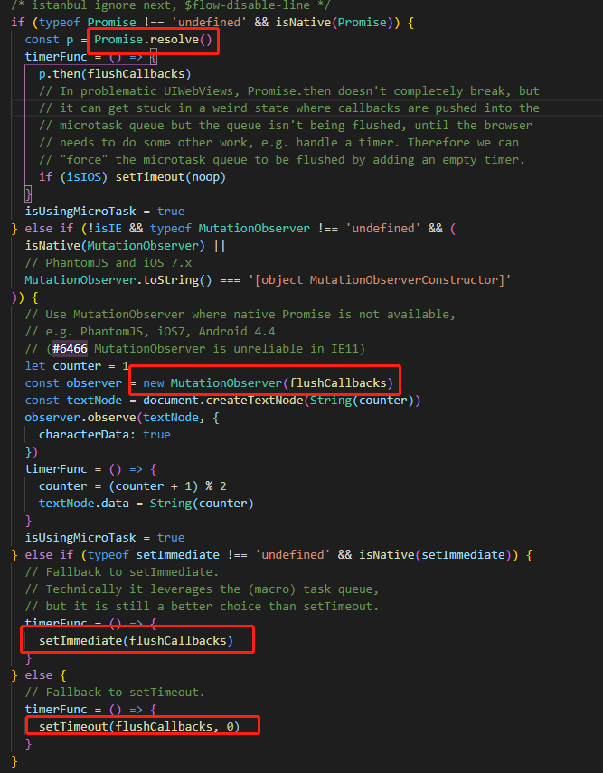

## Vue常见面试题

<!-- TOC -->

- [Vue常见面试题](#vue常见面试题)
    - [v-if和v-for哪个优先级高？如果同时使用，怎么写性能更好？](#v-if和v-for哪个优先级高如果同时使用怎么写性能更好)
    - [为什么Vue组件的data必须返回一个函数，但是Vue的根实例没有这个限制？](#为什么vue组件的data必须返回一个函数但是vue的根实例没有这个限制)
    - [谈谈你对Vue中的key的作用和工作原理的理解](#谈谈你对vue中的key的作用和工作原理的理解)
    - [谈谈你对diff的理解](#谈谈你对diff的理解)
    - [谈一谈对vue组件化的理解](#谈一谈对vue组件化的理解)
    - [谈谈对vue设计原则的理解](#谈谈对vue设计原则的理解)
    - [vue为什么要求组件模板只能有一个根元素？](#vue为什么要求组件模板只能有一个根元素)
    - [谈谈你对MVC、MVP和MVVM的理解](#谈谈你对mvcmvp和mvvm的理解)
    - [Vue中有几种组件通信方式，分别是什么？](#vue中有几种组件通信方式分别是什么)
    - [你了解哪些Vue性能优化方法？](#你了解哪些vue性能优化方法)
    - [你对Vue3.0的新特性有没有了解？](#你对vue30的新特性有没有了解)
    - [Vue如果想扩展某个现有的组件是怎么做？](#vue如果想扩展某个现有的组件是怎么做)
    - [Vue中watch和computed的区别以及怎么选用？](#vue中watch和computed的区别以及怎么选用)
    - [对生命周期的理解](#对生命周期的理解)
        - [初始化](#初始化)
        - [更新](#更新)
        - [销毁](#销毁)
    - [Vuex的使用及其理解](#vuex的使用及其理解)
    - [你知道nextTick的原理吗？](#你知道nexttick的原理吗)
    - [你知道Vue双向数据绑定的原理吗？](#你知道vue双向数据绑定的原理吗)
    - [Vue-router中的导航钩子那些？](#vue-router中的导航钩子那些)
        - [全局导航钩子](#全局导航钩子)
        - [路由配置中的导航钩子](#路由配置中的导航钩子)
        - [组件内的钩子函数](#组件内的钩子函数)
    - [什么是递归组件？](#什么是递归组件)

<!-- /TOC -->

### v-if和v-for哪个优先级高？如果同时使用，怎么写性能更好？

源码位置：`src\compiler\codegen\index.js`

先看看如下写法：

```vue
<div v-if="isShow" v-for="item in list">{{item}}</div>
```

使用`vueInstance.$options.render`可以查看渲染函数

```js
 ƒ anonymous() {
     with(this) {
         return _c('div', {
             attrs: {
                 "id": "app"
             }
         }, _l((list), function (item) {
             return (isShow) ? _c('div', [_v(_s(item))]) : _e()
         }), 0)
     }
 }
```

`_l`是循环列表的函数，由此可以看出，在遍历列表的每一项时都做了`v-if`判断，显然是没有必要的

我们试着换成如下写法：

```vue
<template v-if="isShow">
	<div v-for="item in list">{{item}}</div>
</template>
```

查看生成的渲染函数

```js
ƒ anonymous() {
    with(this) {
        return _c('div', {
            attrs: {
                "id": "app"
            }
        }, [(isShow) ? _c('div', _l((list), function (item) {
            return _c('div', [_v(_s(item))])
        }), 0) : _e()])
    }
}
```

现在的做法是，先判断`v-if`条件，如果为`true`才去执行列表渲染，减少了很多不必要的判断，因此性能会更好。

再来看看源码：



可以看出，`v-for`的优先级高于`v-if`。

**总结：**

1. `v-for`的优先级是高于`v-if`，不同的写法会生成不同的渲染函数;

2. 如果同时使用，最好将`v-if`提取出来，可减少不必要的判断，进而提高渲染性能;

3. 如果列表中的每一项都有一个布尔值决定需不需要显示，可以先用`computed`将不需要显示的数据过滤掉，只留下需要显示的项，这样就不需要每次渲染都进行判断。


### 为什么Vue组件的data必须返回一个函数，但是Vue的根实例没有这个限制？

源码位置：`vue-dev\src\core\instance\state.js`，方法：`initData`

从源码出发



如果`data`选项是函数，会执行并返回结果作为最后`data`的值，如果不是则直接返回。

在组件注册的时候`Vue.component`只会执行一次，如果不使用函数，将会造成在不同的地方使用该组件操作的都是同一个data，会造成数据污染。

而因为跟组件是单例的，所以即使是使用对象形式也不会造成数据污染。

另外，Vue也会对组件的data选项做一个检测，如果使用的是对象，会报错。



实际上，在Vue内部合并选项的时候会对`data`选项进行校验，根实例创建的时候已经有实例会跳过该校验，而组件在合并选项的时候还未生产实例，因此会对`data`选项进行校验。

**总结：**

1. Vue组件可能存在多个实例，为避免不同实例间的`data`数据不相互干扰，需要使用函数形式返回新的`data`;

2. Vue根实例是单例的，因此不需要担心会产生数据污染的情况。


### 谈谈你对Vue中的key的作用和工作原理的理解

源码位置：`vue-dev\src\core\vdom\patch.js`



如果一个列表没有设置`key`，在比较的时候`key`都是`undefined`，每次渲染都会认为新老vdom数组中同一个位置的元素是同一个节点，这个时候会直接执行patch方法，如果发现属性不一样，还是会对dom节点进行更新。

而如果设置了key，会触发内部优化的算法，首尾比较新老数组的结构，可以减少更新。

**总结：**

1. `key`的作用是为了高效的更新虚拟DOM，其原理是精准判断新老节点是否是同一个，避免进行不必要的更新操作，使得patch过程更高效，减少DOM操作，提高性能；
2. 如果不设置`key`，列表更新时可能会和预期不一致；
3. vue在使用相同标签名元素的过渡动画时，如果没有使用`key`，可能会造成vue只替换元素内部属性而不触发过渡效果的问题。


### 谈谈你对diff的理解

diff算法能提高vdom比较效率

源码地址：`vue-dev\src\core\instance\lifecycle.js`，方法：`mountComponent`



每次在挂载组件的时候，都会为组件创建一个对应的Watcher，当数据变更的时候，Watcher就会通知变更，只有通过diff算法才能精准的知道具体变更的是哪个节点。

源码位置：`vue-dev\src\core\vdom\patch.js`，方法：`patchVode`


`patchVode`是diff算法发生的地方，比较的时候遵循策略：深度优先，同层比较。

源码位置：`vue-dev\src\core\vdom\patch.js`，方法：`updateChildren`

比较过程使用首尾两两比较和使用`key`来提高比较效率

**总结：**

1. diff算法就是对新老虚拟DOM进行比较，将变化的地方更新到真实DOM的算法。如果不使用diff算法，直接遍历整个虚拟DOM比较，时间复杂度是O(n³)，而使用diff算法后，比较的时间复杂度可以降低为O(n)；
2. 过程：数据变化→触发setter函数→触发通知→将Watcher推入异步更新队列→事件循环结束之后清空队列→Watcher执行更新函数→使用diff比较生成的新老虚拟dom→找到要更新的节点更新到真实的dom中。


### 谈一谈对vue组件化的理解

**组件定义**

- 全局方式

```js
Vue.component('comp', {
	template: '<div>this is a component</div>'
})
```

源码位置：`vue-dev\src\core\global-api\assets.js`



如果是全局定义的组件，会传递一个组件配置对象，vue会使用extend方法创建组件的构造函数。

- 单文件方法

```vue
<template>
	<div>
		this is a component
	</div>
</template>
```

`vue-loader`会编译`template`为`render`函数，最终导出一个组件的配置对象。

源码地址：`vue-dev\src\core\instance\lifecycle.js`，方法：`mountComponent`

一个组件对应一个Watcher，组件变化时只会渲染组件内部的数据和元素，不会影响其它组件，提高渲染性能。

**总结：**

1. 组件是独立的可复用的代码组织单元;

2. 使用组件化开发能大幅度提高开发效率和测试效率;
3. 组件可以分为：页面组件、业务组件、通用组件;
4. vue的组件是基于配置的，我们通常编写的是组件配置，框架会在后续生成对应的构造函数，他们基于VueComponent，扩展至Vue;
5. vue常见的组件化技术有：prop，自定义事件，插槽等，它们主要用于组件通信、扩展等;
6. 组件应该是高内聚、低耦合的，组件遵循单项数据流原则，合理使用组件有助于提升应用性能。


### 谈谈对vue设计原则的理解

- 渐进式JavaScript框架
- 易用性、灵活、高效

**渐进式**

Vue的核心库只关系视图层，不仅易于上手，还便于与第三方库和既有项目的整合。另外，配合一些现代化工具链以及各种支持的类库结合使用时，Vue也能为复杂的单页面应用提供驱动。

**易用性**

vue提供数据响应式、声明式模板语法和基于配置的核心组件系统，这使我们只需要关注核心业务即可。

会简单的js、html、css就能轻松编写vue应用。

**灵活性**

应用足够小，只需要使用vue的核心特性即可。

随着应用规模扩大，可以逐渐映入路由、状态管理、vue-cli等库和工具。不断繁荣的生态系统，可以在一个库和一套完整框架之间自由伸缩。

**高效性**

引入了虚拟DOM和diff算法使我们的应用拥有极高的性能表现。

vue3中引入Proxy对数据响应式的改进以及编译器中对静态内容编译的改进都会让vue更加高效。


### vue为什么要求组件模板只能有一个根元素？

1. 在实例化vue的时候`new Vue({el: '#app'})`，需要给实例指定一个入口元素，入口只能有一个。

2. 在使用单文件组件时

   ```vue
   <template>
   	<div>
           
       </div>
   </template>
   ```

   `template`这个标签具有三个特性：

   1. 隐藏性：渲染的时候不会显示在`html`结构中，相当于设置了`display: none`；
   2. 任意性：该标签可写在任何地方，甚至是`head`、`body`、`script`标签内；
   3. 无效性：该标签里的任何HTML内容都是无效的，不会起任何作用，只能使用`innerHTML`来获取里面的内容。

   所以，`template`标签不能当做跟节点，在使用的时候是获取`template`内部的元素，所以还是需要使用一个`div`标签作为根节点。

3. 在进行diff中的`patchVnode`方法时，依据的是遍历一个树状的数据结构，而树只能有一个根节点。


### 谈谈你对MVC、MVP和MVVM的理解

- 这三者都是一种框架模式，它们设计的目标都是为了解决Mode和View的耦合问题。
- MVC模式出现较早，主要应用在后端，如`Spring MVC`、`ASP.NET MVC`等，在前端领域的早期也有应用，如`Backbone.js`。它的优点是分层清晰，缺点是数据流混乱，灵活性差带来的维护性问题。
- MVP模式是MVC的进化形式，Presenter作为中间层负责MV通信，解决两者耦合问题，但P层过于臃肿会导致维护问题。
- MVVM模式在前端领域有广泛应用，它不仅解决MV耦合问题，还同时解决了维护两者映射关系的大量繁杂代码和DOM操作代码，在提高开发效率、可读性的同时还保持了优越的性能。


### Vue中有几种组件通信方式，分别是什么？

按使用场景可以分三类：

1. 父子组件通信
2. 兄弟组件通信
3. 跨层级通信

通信方式：

1. **props：**适合父子之间的简单数据传递

2. **$emit/$on，事件总线：**可以进行父子组件、兄弟组件、跨级组件的通信

3. **vuex：**可以进行父子组件、兄弟组件、跨级组件的通信，适合在复杂项目中，多层级嵌套通信或需要保留数据状态的时候使用

4. **$parent/$children、ref：**直接得到组件实例，使用后可以直接调用组件的方法或访问数据。无法跨级或在兄弟组件间通信，只适用于父子组件通信

   - `ref`：如果在普通的 DOM 元素上使用，引用指向的就是 DOM 元素；如果用在子组件上，引用就指向组件实例

   - `$parent / $children`：访问父 / 子实例

5. **$attrs/$listeners：**适合跨组件传递数据

   * `$attrs`：包含了父作用域中不被` prop` 所识别 (且获取) 的特性绑定 (`class` 和` style `除外)。当一个组件没有声明任何 `prop` 时，这里会包含所有父作用域的绑定 (`class `和 `style`除外)，并且可以通过` v-bind="$attrs" `传入内部组件。通常配合` interitAttrs `选项一起使用。
   * `$listeners`：包含了父作用域中的 (不含 `.native` 修饰器的)` v-on` 事件监听器。它可以通过` v-on="$listeners"` 传入内部组件

6. **provide/inject**：适合跨级组件通信

   Vue2.2.0新增API，这对选项需要一起使用，以允许一个祖先组件向其所有子孙后代注入一个依赖，不论组件层次有多深，并在起上下游关系成立的时间里始终生效。一言而蔽之：祖先组件中通过`provider`来提供变量，然后在子孙组件中通过`inject`来注入变量。

   `provide / inject ` API主要解决了跨级组件间的通信问题，不过它的使用场景，主要是子组件获取上级组件的状态，跨级组件间建立了一种主动提供与依赖注入的关系。


### 你了解哪些Vue性能优化方法？

- 路由懒加载

  ```js
  const router = new VueRouter({
  	routes: [
  		{ path: '/foo', component: ()=> import('./Foo.vue') }
  	]
  })
  ```

- `keep-alive`缓存页面

  ```vue
  <template>
  	<div id="app">
          <keep-alive>
      		<router-view/>
      	</keep-alive>
      </div>
  </template>
  ```

- 使用`v-show`复用DOM

  ```vue
  <template>
  	<div class="ceil">
          <!--这种情况用v-show复用DOM，比v-if效果好-->
          <div v-show="value" class="on">
            	<!--Heavy代表渲染时间较长的组件-->
              <Heavy :n="1000"/>
      	</div>
          <section v-show="!value" class="off">
      		<Heavy :n="1000" />
      	</section>
      </div>
  </template>
  ```

- `v-for`遍历避免同时使用`v-if`

  ```vue
  <template>
  	<ul>
          <li
              v-for="user in activeUsers"
              :key="user.id">
              {{user.name}}
      	</li>
      </ul>
  </template>
  
  <script>
      export default {
      	computed: {
              activeUsers() {
              	return this.users.filter(user => user.isActive);
              }
          }
      }
  </script>
  ```

- 长列表性能优化

  - 如果列表是纯粹的数据展示，不会有任何改变，就不需要做响应化

  ```js
  export default {
      data: () => ({
          users: []
      }),
      async created() {
          const users = await axios.get('/api/users');
          this.users = object.freeze(users); // 不进行响应化
      }
  }
  ```

  - 如果是大数据长列表，可采取虚拟滚动，只渲染少部分区域的内容

  ```vue
  <recycle-scroller
  	class="items"
      :items="items"
      :item-size="24"
  >
  	<template v-sloat="{item}">
      	<FetchItemView
            :item="item"
            @vote=“voteItem(item)”
          />
      </template>
  </recycle-scroller>
  ```

  > 参考：[vue-virtual-scroller](https://www.npmjs.com/package/vue-virtual-scroller)、[vue-virtual-scrol-list](https://www.npmjs.com/package/vue-virtual-scroll-list)
  
- 事件的销毁

  Vue组件销毁时，会自动解绑它的全部指令及事件监听器，但是仅限于组件本身的事件，所以自定义事件需要自己解绑。

  ```js
  created(){
      this.timer = setInterVal(this.refresh, 2000)
  },
  beforeDetroy(){
       clearInterval(this.timer)
  }
  ```

- 图片懒加载

  对于图片过多的页面，为了加速页面加载速度，所以很多时候我们需要将页面内未出现在可视区域内的图片先不做加载，等到滚动到可视区域后再去加载。

  ```vue
  
  ```

  > 参考：[vue-lazyload](https://www.npmjs.com/package/vue-lazyload)

- 第三方插件按需引入

  像`element-ui`这样的第三方组件库可以按需引入避免体积太大。

  ```js
  import vue from 'vue';
  import { Button, slect } from 'element-ui';
  
  Vue.use(Button)
  Vue.use(Select)
  ```

- 无状态的组件标记为函数式组件

  函数式组件无组件实例，消耗资源较小

  ```vue
  <template>
  	<div class="cell">
          <div v-if="props.value" vlass="on"></div>
          <section v-else class="off"></section>
      </div>
  </template>
  
  <script>
  export default{
      props: ['value']
  }
  </script>
  ```

- 子组件分割

  复制内容提取出来一个子组件，让其自己管理自己内部的状态

  ```vue
  <template>
  	<div>
          <ChildComp/>
      </div>
  </template>
  
  <script>
  export default {
      componets: {
          childComp: {
              methods: {
                  heavy() { /* 耗时任务 */ }
              },
              render (h) {
                  return h('div', this.heavy())
              }
          }
      }
  }
  </script>
  ```

- 变量本地化

   ```vue
  <template>
  	<div :style="{ opacity: start / 300 }">
  		{{ result }}        
      </div>
  </template>
  
  <script>
  import { heavy } from '@/utils'
      
  export default {
      props: ['start'],
      computed: {
          base () { return 42 },
          result () {
              const base = this.base // 不要频繁引用this.base
              let result = this.start
              for (let i = 0; i < 1000; i++){
                  result += heavy(base)
              }
              return result
          }
      }
  }
  </script>
  ```

- SSR

  提交首屏渲染速度，优化SEO。


### 你对Vue3.0的新特性有没有了解？

Vue3.0改进主要在以下几点：

- 更快
  - 虚拟DOM重写
  - 优化`slots`的生成
  - 静态树提升
  - 静态属性提升
  - 基于Proxy的响应式系统
- 更小：通过摇树优化核心库体积
- 更容易维护：`TypeScript` + 模块化
- 更加友好
  - 跨平台：编译器核心和运行时核心与平台无关，使得Vue更容易与任何平台（`We`b、`Android`、`IOS`）一起使用
- 更容易使用
  - 改进的`TypeScript`支持，编辑器能提供强有力的类型检测和错误警告等
  - 更好的调试支持
  - 独立的响应化模块
  - Composition API 

**虚拟DOM重写**

期待更多的编译时踢死来减少运行时开销，使用更有效的代码来创建虚拟节点。

组件快速路径+单个调用+子节点类型检测

- 跳过不必要的条件分支
- JS引擎更容易优化

**优化slots生成**

Vue3中可以单独重写渲染父级和子级

- 确保实例振全的跟踪依赖关系
- 避免不必要的父子组件重新渲染

**静态树提升（Static tree Hoisting）**

使用静态树提升，这意味着Vue3的编译器将能够检测到什么是 静态的，然后将其提升，从而降低了渲染成本。

- 跳过修补整颗树，从而降低渲染成本
- 即使多次出现也能正常工作

**静态属性提升**

使用今天属性提升，Vue3打补丁时将跳过这些属性不会改变的节点。

**基于Proxy的数据响应式**

Vue2的响应式使用`Object.defineProperty`的`getter`和`setter`。Vue3将使用ES2015 Proxy作为其观察机制，这将会带来如下变化：

- 组件实例初始化的速度提高100%
- 使用Proxy节省以前一半的内存开销，加快速度，但是存在低版本浏览器不兼容的问题
- 为继续支持`IE11`，Vue3将发布一个支持就观察者机制和新Proxy版本的构建

> 资料：[尤雨溪Vue3.0 PPT](https://mp.weixin.qq.com/s/9Ml1DCpWhuCw3nIvpoYFnQ)

高可维护性

Vue3将带来更可维护的源代码。它不仅会使用`TypeScript`，而且许多包倍解耦，更加模块化。


### Vue如果想扩展某个现有的组件是怎么做？

1. 使用`Vue.mixin`全局混入

   混入（`mixins`）是一种分发Vue组件中可复用功能的非常灵活的方式。混入对象可以包含任意组件选项。当组件使用混入对象时，所有混入对象的选项将被混入该组件本身的选项。`mixins`选项接受一个混合对象的数组。

   - 在写好的组件配置中需要扩展组件功能或临时增加活动，用混入会减少源代码污染
   - 公共方法可以使用混入提取出来，减少代码量，增加复用性

   > 调用顺序：全局混入 > 局部混入 > 组件本身的方法

2. 加`slot`扩展

   `slot`可以用来获取组件中的原内容，分为默认插槽和具名插槽。


### Vue中watch和computed的区别以及怎么选用？

`watch`更通用，`computed`的派生功能都能实现，计算属性底层使用`watch`实现，加入了缓存功能。

`computed`更简答，更高效，优先使用，有些时候必须使用`watch`，比如值变化的时候要和后端进行交互。

使用场景：

- `watch`：`watch`需要在数据变化时只需异步或开销较大的操作时使用，简单讲，当一条数据影响多条数据的时候，例如搜索数据
- `computed`：对任何复杂逻辑或一个数据属性在它所以来的属性发生变化时，也要发生变化，简单讲，当一个属性收到多个属性影响的时候，例如：购物车商品结算时


### 对生命周期的理解

图解：


#### 初始化

**new Vue()**

新建Vue实例

**init Events & LifeCycle**

初始化事件和生命周期，只有一些默认事件和生命周期

**beforeCreate**

还拿不到data和method的数据，还没有初始化

**init injections & reactivity**

给数据添加watcher，

**created**

可以访问`data`数据

源码位置：`vue-dev\src\core\instance\init.js`，方法：`initMixin`



**优先级顺序：el < template < render**

**beforeMount**

挂载前

**创建`vm.$el`并用其替换“el”**

**mounted**

挂载完成，初始化完毕，可以操作dom

源码位置：`vue-dev\src\core\instance\lifecycle.js`，方法：`mountComponent`

#### 更新

源码位置：`vue-dev\src\core\instance\lifecycle.js`，方法：`mountComponent`

**beforeUpdate**

数据更新前

**虚拟DOM重新渲染并执行patch**

**updated**

更新完成后

#### 销毁

源码位置：`vue-dev\src\core\instance\lifecycle.js`，方法：` Vue.prototype.$destroy`

**beforeDestroy**

销毁前

**接触绑定，销毁子组件和事件监听器**

**destroyed**

组件销毁完毕


### Vuex的使用及其理解


1. `Vuex`是什么？
2. 核心概念是什么？
   - `state`
   - `mutation`
   - `action`
   - getter`
   - `modal`
3. 怎么做数据存储？
4. 什么情况下应该使用`Vuex`？
5. `Vuex`理解（源码）


### 你知道nextTick的原理吗？

`nextTick`可以在DOM更新完毕后之后执行一个回调

```js
// 修改数据
vm.msg = 'Hello'
// DOM 还没有更新
Vue.nextTick(()=>{
// DOM 更新了
})
```

Vue会将`nextTick`回调加入异步队列

源码位置：`dist\vue.esm.browser.js`



> Vue会根据浏览器兼容情况做降级处理，优先级：Promise.resolve>MutationObserver>setImmediate>setTimeout

扩展：`MutationObserver`是HTML5新增的属性，用于监听DOM修改时间，能够监听到节点的属性、文本内容、子节点等的改动，是一个功能强大的利器。

```js
// MutationObserver基本用法
var observer = new MutationObserver(()=>{
    console.log(‘DOM被修改了’);
})
var article = document.querySelector('article');
observer.observer(article);
```

> 参考：[任务，微任务、队列和时间表](https://jakearchibald.com/2015/tasks-microtasks-queues-and-schedules/?utm_source=html5weekly)

**总结：**

1. Vue用异步队列的方式来控制DOM更新和`nextTick`回调先后执行；
2. `Microtak`因为其高优先级特性，能确保队列中的微任务在一次事件循环前被执行完毕；
3. 因为兼容性问题，Vue不得不做`Microtask`向`Macrotask`的降级方案。


### 你知道Vue双向数据绑定的原理吗？

双向数据绑定：数据变化更新视图，视图变化更新数据。

设计模式： 观察者模式

**Dep对象**

Dependency依赖的简写，包含有三个属性：

- `id`：每个依赖对象的唯一标识
- `subs`：观察者对象的订阅者列表
- `target`：全局唯一的正在执行的订阅者对象

还包含四个主要函数：

- `addSub`：使用push方法添加订阅者
- `removeSub`：使用splice移除订阅者
- `depend`：将自己添加到当前订阅者的依赖列表
- `notify`：数据更新时，通知subs数组中的每个订阅者更新

对象使用`object.defineProperty`收集依赖，触发更新。

数组通过重写数组的方法实现响应式。

重写的数组方法包括：

- `push`
- `pop`
- `shift`
- `unshift`
- `splice`
- `sort`
- `reverse`

**总结：**

- 使用`getter`和`setter`代理值得获取和赋值，使我们可以控制数据流向
- 使用观察者模式，建立指令和数据的依赖关系，触发更新


### Vue-router中的导航钩子那些？

分为三类：

- 全局导航钩子
- 路由配置中的导航钩子
- 组件内部的导航钩子

#### 全局导航钩子

- `beforeEach(to, from, next)`

  - 常用于验证用户权限

  参数：

  - `to`：即将要进入的目标路由对象
  - `from`：当前正要离开的路由对象
  - `nex`：路由控制参数
    - `next()`：如果一切正常，则调用这个方法进入下一个页面
    - `next(false)`：取消导航（即路由不发生改变）
    - `next('/login')`：中断当前导航，开启新的导航到指定页面
    - `next(error)`：如果是一个`Error`实例，则导航会被终止且该错误会被传递给`router.onError()`

- `afterEach(to, from)`路由改变后的钩子

  - 常用于自动让页面返回最顶端

  - 用法相似，没有next参数

#### 路由配置中的导航钩子

- `beforeEnter(to, from, next)`

#### 组件内的钩子函数

- `beforeRouteEnter(to, from, next)`

  - 该组件的对应路由在触发`confirm`前调用

  - 此时实例还没有创建，所有不能获取实例(`this`)

- `beforeRouteUpdate(to, from, next)`

  - 当前路由改变，当组件被复用的时候调用
  - 改函数内可以访问组件实例(`this`)

- `beforeRouteLeave(to, from, next)`

  - 当导航离开组件的对应路由时调用
  - 该函数内可以访问获取组件实例(`this`)

  

**监听路由变化**

还可以使用`watch`方法监听路由变化

```js
watch: {
    `$route` (to, from){
        
    },
    `$route.query.id`{
        
    }
}
```


### 什么是递归组件？

组件可以在它们自己的模板中调用自己。

递归组件，一定要有一个结束条件，否则就会造成循环引用，我们可以使用`v-if="false"`作为递归组件的结束条件。

一般递归组件适用于树状的数据结构。