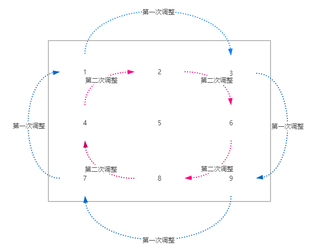

##  [leetcode初级算法(数组篇)](https://leetcode-cn.com/explore/interview/card/top-interview-questions-easy/1/array/)

注：**点标题可以查看对应的题目**，本文代码均使用`Javascript`编写。本文代码不一定是最优解，仅供参考，如大佬们有更好的实现，欢迎交流。


### [删除排序数组中的重复项](https://leetcode-cn.com/explore/interview/card/top-interview-questions-easy/1/array/21/)

解析：首先要注意关键词，**排序数组**、**原地**、**不需要考虑数组中超出新长度后面的元素**。有这些已知条件，解决起来就简单很多了。

思路：

1. 遍历数组，使用一个临时遍历存储新的不重复的值；
2. 当数组中有不同的值出现时，更新数组、临时值，并给计数变量加1；
3. 最后返回不重复的数据的数量。

代码：

```javascript
/**
 * @param {number[]} nums
 * @return {number}
 */
var removeDuplicates = function(nums) {
    // 如果数组为空，直接返回0
    if(nums.length === 0){
        return 0;
    }
    
    var length = 1; // 不重复值的数量，只要数组不为空，至少有一个值是不重复的，所以初始值为1
	var temp = nums[0]; // 存储新的不重复的值
    
    for(var i = 1; i < nums.length; i++){
        if(nums[i] !== temp){
            temp = nums[i]; // 更新不重复的值
            nums[length] = nums[i]; // 更新原数组
            length++; // 更新下标
        }
    }
    
    return length; // 返回不重复数据数量
};
```


### [买卖股票的最佳时机 II](https://leetcode-cn.com/explore/interview/card/top-interview-questions-easy/1/array/22/)

解析： 这里使用了贪心算法思想，贪心算法简单来说就是：**局部最优解达成全局最优解**。只关心局部最优的解决方法，累加局部最优的的解产生的就是全局最优解。就是把一个复杂的问题拆分成很多相同的小问题，解决小问题后，大问题也就解决了。使用贪心算法的条件是：**局部最优策略能产生全局最优解**。有时候局部最优解不一能产生全局最优解，所以在使用之前需要分析。本题**获取最大利润**是**全局解**，**局部最优解**是**只关心相邻两天，只要今天股票比昨天股票价高股就进行交易**。

思路：

1. 定义一个变量存储收益总和；
2. 遍历数组，计算今天减昨天的收益，累加；
3. 返回收益总和。

代码：

```javascript
/**
 * @param {number[]} prices
 * @return {number}
 */
var maxProfit = function(prices) {
    if(!prices || prices.length <= 0){
        return;
    }
    
    var maxProfit = 0; // 收益总和
    for(var i = 0; i < prices.length - 1; i++){
       // 今天股价比昨天股价高，则进行一次买卖操作
       if(prices[i] < prices[i + 1]){
           maxProfit += prices[i + 1] - prices[i]; // 计算相邻两天股票差价的收益
       }
    }
    
    return maxProfit;
};
```


### [旋转数组](https://leetcode-cn.com/explore/interview/card/top-interview-questions-easy/1/array/23/)

解析：这里`k`是非负数，不用考虑向左旋转的情况。向右旋转`k`步就是剪切数组末尾的`k`项贴到数组头部。旋转步数和数组长度一样时相当于没有变化。

代码：

```javascript
/**
 * @param {number[]} nums
 * @param {number} k
 * @return {void} Do not return anything, modify nums in-place instead.
 */
var rotate = function(nums, k) {
    var len = nums.length;
    k = k % len; // 求余数，防止k大于数组长度
    var temp1 = nums.splice(len - k, k); // 获取数组末尾的k项
    nums.unshift(...temp1); // 拼接到原数组的头部
};
```


### [存在重复元素](https://leetcode-cn.com/explore/interview/card/top-interview-questions-easy/1/array/24/) 

解析：利用对象记录当前值是否已存在，对象的属性名为当前值。

代码：

```javascript
/**
 * @param {number[]} nums
 * @return {boolean}
 */
var containsDuplicate = function(nums) {
    var object = {};
    for(var i = 0; i < nums.length; i++){
        var cur = nums[i];
        // 当前值存在 返回true
        if(object[cur]){
            return true;
        }else{
            // 当前值不存在，记录一下
            object[cur] = true
        }
    }
    return false; // 遍历完整个数组没有发现重复的值，则返回false
};
```


### [只出现一次的数字](https://leetcode-cn.com/explore/interview/card/top-interview-questions-easy/1/array/25/)

解析：使用位运算——异或。异或：相同取0，不同取1。

例：3 ^ 4，3的二进制位为：011，4的二进制为100，3异或4得出：111，转回十进制也就是：7。

思路：利用相同的数异或为0，任何数与0进行异或等于它本身的规则进行查找。这里实现上使用的是`es6`的[`reduce`](https://developer.mozilla.org/zh-CN/docs/Web/JavaScript/Reference/Global_Objects/Array/Reduce)方法。

代码：

```javascript
/**
 * @param {number[]} nums
 * @return {number}
 */
var singleNumber = function(nums) {
    return nums.reduce((prev, cur) => (prev ^ cur), 0); // 将0与第一位的数进行异或，得出的结果再与下一位数进行异或
};
```


### [两个数组的交集 II](https://leetcode-cn.com/explore/interview/card/top-interview-questions-easy/1/array/26/)

解析：求两个数组的交集，最简单粗暴的方法就是依次比较两个数组的值是否相等。这道题看似简单，实际上网上很多答案都是错的，他们没有考虑到比较重复值的情况。

代码：

```javascript
/**
 * @param {number[]} nums1
 * @param {number[]} nums2
 * @return {number[]}
 */
var intersect = function (nums1, nums2) {
    var result = []; // 交集
    var comparedIndex = []; // 记录比较过的索引值
    for (var i = 0; i < nums1.length; i++) {
        for (var j = 0; j < nums2.length; j++) {
            // 找出相同的并且还未加入结果的值
            if (nums1[i] === nums2[j] && comparedIndex.indexOf(j) === -1) {
                result.push(nums1[i]); // 加入相同的值
                comparedIndex.push(j); // 记录当前索引值
                break; // 找到一个相同的则终止循环体，无需比较后续的值
            }
        }
    }
    return result;
};
```

也可以使用`es6`的[`filter`](https://developer.mozilla.org/zh-CN/docs/Web/JavaScript/Reference/Global_Objects/Array/filter)方法：过滤出`num1`中在`num2`中也存在的数据。

代码：

```javascript
/**
 * @param {number[]} nums1
 * @param {number[]} nums2
 * @return {number[]}
 */
var intersect = function (nums1, nums2) {
    const nums2Copy = [...nums2]; // 建一个nums2的备份
    return nums1.filter(ele => {
        const index = nums2Copy.indexOf(ele); // 查看nums2Copy中是否存与当前值相同
        if (index !== -1) { // 如果找得到
            nums2Copy.splice(index, 1); // 在nums2Copy中删除找过的值
            return true; // 返回当前值
        }
    });
};
```


### [加一](https://leetcode-cn.com/explore/interview/card/top-interview-questions-easy/1/array/27/)

解析：先将数组转化为数字，再将数字加一，然后再转回为数组。

思路：

1. 数组装字符串；
2. 字符串装数字；
3. 数字加1；
4. 数字装字符串；
5. 字符串转数组；

注意：字符串过长会导致转换成数字类型时精度缺失，所以这里要使用`es6`的新数据类型[`BigInt`](https://developer.mozilla.org/zh-CN/docs/Web/JavaScript/Data_structures)

代码：

```javascript
/**
 * @param {number[]} digits
 * @return {number[]}
 */
var plusOne = function(digits) {
    var result = digits.join(''); // 数组转字符串
    result = BigInt(result); // 字符串转BigInt
    result += BigInt(1); // 加1
    result = result.toString().split(''); // 转换回数组
    return result;
};
```

解法二：使用循环，遍历数组，满10进1。

代码：

```javascript
/**
 * @param {number[]} digits
 * @return {number[]}
 */
var plusOne = function(digits) {
    const result = [...digits]; // 备份数组
    const end = result.length - 1;
    for(let i = end; i >= 0; i--){
        if(result[i] === 9){ // 当前位置的数为9时
            result[i] = 0; // 当前数加一后就变为0
            if(i - 1 >= 0){ // 没有超过数组长度，直接进行后续循环
              continue;
            }else{
                result.unshift(1); // 超过数组元长度，头部加一位数字1
                break;
            }
        }else{
            result[i] += 1; // 当前位置数字不为9，直接加1
            break; // 不发生进位，跳出循环
        }
    }
    return result;
};
```


### [移动零](https://leetcode-cn.com/explore/interview/card/top-interview-questions-easy/1/array/28/)

解析：遍历数组，使用一个遍历记录0的数量，当遇到一个0的时候，记录0的个数，遇到不是0的时候，将当前数的值往前移动与当前0的数量相同距离。并将当前值变为0。

代码：

```javascript
/**
 * @param {number[]} nums
 * @return {void} Do not return anything, modify nums in-place instead.
 */
var moveZeroes = function(nums) {
    if(nums.length <= 1){ // 数组小于1位，直接返回
        return;
    }
    var zeroNums = 0; // 当前0的个数
	for(var i = 0; i < nums.length; i++){
        if(nums[i] === 0){ // 当前值为0时
            zeroNums += 1; // 0的个数加1
        }else if(zeroNums > 0){ // 0的数量不为0时
            nums[i - zeroNums] = nums[i]; // 将当前值往前移动zeroNums位
            nums[i] = 0; // 将当前值变为0
        }
    }
};
```


### [两数之和](https://leetcode-cn.com/explore/interview/card/top-interview-questions-easy/1/array/29/)

解析：使用双重循环，每次计算当前索引的值和剩下索引的值的和相加是否为目标值，是则返回相加的两个索引值。

代码：

```javascript
/**
 * @param {number[]} nums
 * @param {number} target
 * @return {number[]}
 */
var twoSum = function(nums, target) {
    var len = nums.length;
    for(var i = 0; i < len; i++){
        for(var j = i + 1; j < len; j++){
            if(nums[i] + nums[j] === target){
                return [i, j];
            }
        }
    }
};
```


### [有效的数独](https://leetcode-cn.com/explore/interview/card/top-interview-questions-easy/1/array/30/)

解析：二维数组，双重循环是少不了的。校验的规则很明确有三点，现在有的已知条件是循环是的两个下标`i`和`j`，要根据已知条件完成校验规则的校验。

思路：

1. 数字 `1-9` 在每一行只能出现一次。

   这个其实和之前的数组去重是一个原理，用一个对象记录一个值是否已经存在，如果存在，第二次在遇到这个值就说明校验不通过。

2. 数字 `1-9` 在每一列只能出现一次。

   列和行的判断其实一样，只需要将索引交换即可，例：`arr[0][2]`代表第1行的第3个数，那么`arr[2][0]`就代表第1列第三个数。

3. 数字 `1-9` 在每一个以粗实线分隔的 `3x3` 宫内只能出现一次。

   这里要找规律，宫有9个，行和列表也有9个，如果能找到每个宫的下标和行列下标（也就是`i`和`j`）的关系，就可以循环行的时候对9个宫进行重复数据判断了。这里的规律要靠不断尝试试出来的，对数字敏感的人想的可能快一下，没有什么特定的套路，话不多说，直接上规律：

   - 宫的行坐标 = 3 * (i / 3) + j / 3;

   - 宫的列坐标 = 3 * (i % 3) + j % 3;

   - 宫与行的关系：第i行代表第i+1个宫；

     

   

   代码：

   ```javascript
   /**
    * @param {character[][]} board
    * @return {boolean}
    */
   var isValidSudoku = function (board) {
       for (var i = 0; i < 9; i++) {
           var rowShowOnce = {}; // 校验行是否无重复项
           var colShowOnce = {}; // 校验列是否无重复项
        var squareShowOnce = {}; // 校验宫是否无重复项
           for (var j = 0; j < 9; j++) {
               var row = board[i][j]; // 行的值
               var col = board[j][i]; // 列的值
               var squareX = 3 * Math.floor(i / 3) + Math.floor(j / 3); // 宫的行坐标
               var squareY = 3 * (i % 3) + j % 3; // 宫的列坐标
               var square = board[squareX][squareY]; // 宫的值
            	// 判断当前行值在同一行中是否存在   
               if (row !== '.') {
                   if (rowShowOnce[row]) {
                       return false; // 已存在，行校验不过，返回false
                   } else {
                       rowShowOnce[row] = true;
                   }
               }
               // 判断当前列值在同一列中是否存在
               if (col !== '.') {
                   if (colShowOnce[col]) {
                       return false; // 已存在，列校验不过，返回false
                   } else {
                       colShowOnce[col] = true;
                   }
               }
               // 判断当前宫值在同一个宫中是否存在
               if (square !== '.') {
                   if (squareShowOnce[square]) {
                       return false; // 已存在，宫校验不过，返回false
                   } else {
                       squareShowOnce[square] = true;
                   }
               }
           }
       }
       return true;
   };
   ```
   
   

### [旋转图像](https://leetcode-cn.com/explore/interview/card/top-interview-questions-easy/1/array/31/)

解析：这种题一般将变化情况列举出来，然后找下标变化规律就好。


第一行：

| 原下标 | 新下标 |  值  |
| :----: | :----: | :--: |
|  0,0   |  0,2   |  1   |
|  0,1   |  1,2   |  2   |
|  0,2   |  2,2   |  3   |

第二行：

| 原下标 | 新下标 |  值  |
| :----: | :----: | :--: |
|  1,0   |  0,1   |  4   |
|  1,1   |  1,1   |  5   |
|  1,2   |  2,1   |  6   |

第三行：

| 原下标 | 新下标 |  值  |
| :----: | :----: | :--: |
|  2,0   |  0,0   |  7   |
|  2,1   |  1,0   |  8   |
|  2,2   |  2,0   |  9   |

不难看出：

- 新的行下标 = 旧的列坐标
- 新的列坐标 = n - 1 - 旧的行坐标

但是，这里题目要求在**原地**旋转，当前规律适用于建一个新的矩阵，所以还要想想其它办法。

分析：为达到**原地**旋转，每次调整就得一次到位，矩形四条边，一次调整四个数据的位置。



第一次调整：

| 步骤 | 原下标 | 新下标 |  值  |
| :--: | :----: | :----: | :--: |
|  1   |  0,0   |  0,2   |  1   |
|  2   |  0,2   |  2,2   |  3   |
|  3   |  2,2   |  2,0   |  9   |
|  4   |  2,0   |  0,0   |  7   |

第二次调整：

| 步骤 | 原下标 | 新下标 |  值  |
| :--: | :----: | :----: | :--: |
|  1   |  0,1   |  1,2   |  4   |
|  2   |  1,2   |  2,1   |  2   |
|  3   |  2,1   |  1,0   |  6   |
|  4   |  1,0   |  0,1   |  8   |

代码：

```javascript
/**
 * @param {number[][]} matrix
 * @return {void} Do not return anything, modify matrix in-place instead.
 */
var rotate = function(matrix) {
    var n = matrix.length;
	for(var i = 0; i < n / 2; i++){
        for(var j = i; j < n - 1 - i; j++){
            // 交换两个值
            var temp = matrix[i][j];
            matrix[i][j]=matrix[n-1-j][i]; // 步骤4
            matrix[n-1-j][i]=matrix[n-1-i][n-1-j]; // 步骤3
            matrix[n-1-i][n-1-j]=matrix[j][n-1-i]; // 步骤2
            matrix[j][n-1-i]=temp; // 步骤1
        }
    }
};
```

