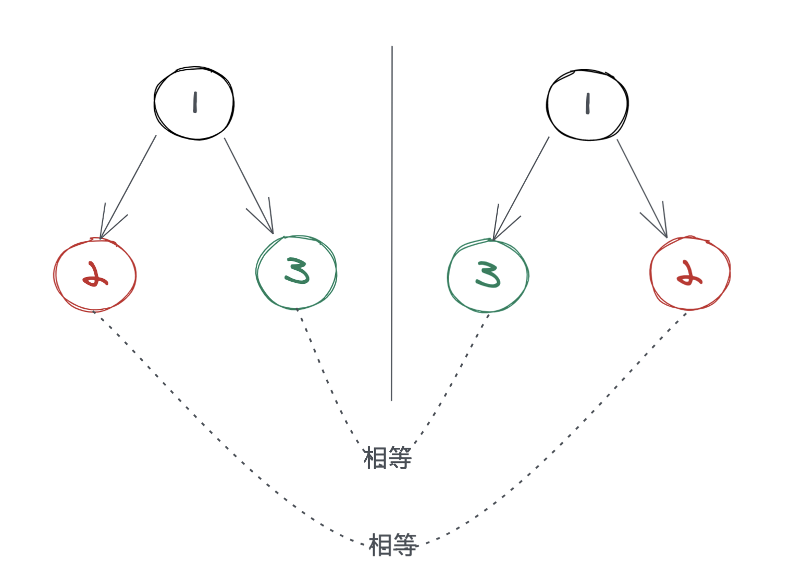
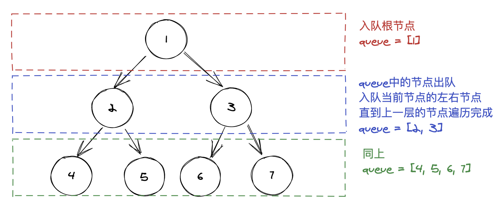
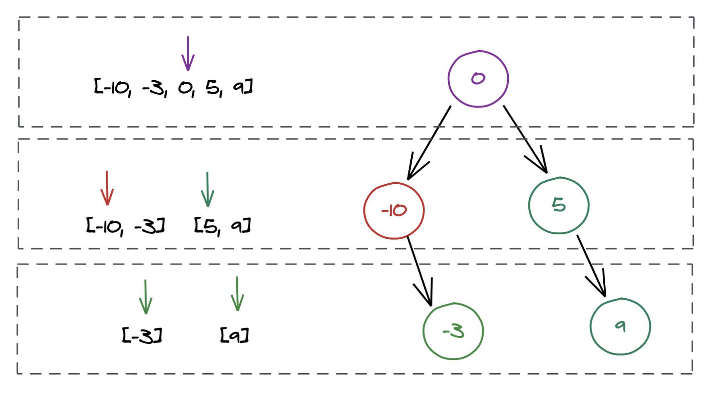

##  [leetcode初级算法(树篇)](https://leetcode-cn.com/leetbook/read/top-interview-questions-easy/x28wnt/)

注：**点标题可以查看对应的题目**，本文代码均使用`Javascript`编写。本文代码不一定是最优解，仅供参考，如大佬们有更好的实现，欢迎交流。


### [二叉树的最大深度](https://leetcode-cn.com/leetbook/read/top-interview-questions-easy/xnd69e/)

#### 深度优先遍历

解析：使用递归，如果知道了左子树和右子树的深度，那么这棵树的深度就是`Max(leftDepth, rightDepth) + 1`。

步骤：

1. 当前节点为空，返回0；
2. 获取左右子树的深度；
3. 返回左右子树深度中大的那个加1。

代码：

```javascript
/**
 * Definition for a binary tree node.
 * function TreeNode(val, left, right) {
 *     this.val = (val===undefined ? 0 : val)
 *     this.left = (left===undefined ? null : left)
 *     this.right = (right===undefined ? null : right)
 * }
 */
/**
 * @param {TreeNode} root
 * @return {number}
 */
var maxDepth = function (root) {
    if (root === null) {
        return 0;
    }
    const leftDepth = maxDepth(root.left);
    const rightDepth = maxDepth(root.right);
    return Math.max(leftDepth, rightDepth) + 1;
};
```


#### 广度优先遍历

解析：使用队列，用队列存每一层的结点，然后每清空一次队列，深度加1。

步骤：

1. 根节点为空，返回0；
2. 定义一个队列，存放当前的根节点，定义并初始化深度变量为0；
3. 当前队列中的结点出列，其左右子节点入列；
4. 深度加1；
5. 重复3、4直到队列为空；
6. 返回深度。

代码：

```js
/**
 * Definition for a binary tree node.
 * function TreeNode(val, left, right) {
 *     this.val = (val===undefined ? 0 : val)
 *     this.left = (left===undefined ? null : left)
 *     this.right = (right===undefined ? null : right)
 * }
 */
/**
 * @param {TreeNode} root
 * @return {number}
 */
var maxDepth = function (root) {
    if (root === null) {
        return 0;
    }
    let queue = [root];
    let depth = 0;
    while (queue.length !== 0) {
        let length = queue.length; // 保存当前队列的大小
      	// 进行下一层结点的入队操作
        while (length > 0) {
            const cur = queue.shift();
            if (cur.left) {
                queue.push(cur.left);
            }
            if (cur.right) {
                queue.push(cur.right);
            }
            length--;
        }
        depth++; // 当前层遍历完成，深度加1
    }
    return depth;
};
```


### [验证二叉搜索树](https://leetcode-cn.com/leetbook/read/top-interview-questions-easy/xn08xg/)

#### 递归

解析：二叉搜索，左子树所有节点都小于当前根节点，右子树的所有节点都大于当前根节点

步骤：

1. 如果当前节点为空，返回true；
2. 递归遍历左右子树，满足左子树<根节点<右子树；
3. 满足返回true，不满足返回false；
4. 返回结果。

代码：

```js
/**
 * Definition for a binary tree node.
 * function TreeNode(val, left, right) {
 *     this.val = (val===undefined ? 0 : val)
 *     this.left = (left===undefined ? null : left)
 *     this.right = (right===undefined ? null : right)
 * }
 */
const helper = (root, lower, upper) => {
    if (root === null) {
        return true;
    }
  	// 不满足条件返回false
    if (root.val <= lower || root.val >= upper) {
        return false;
    }
  	// 满足条件继续判断后续结点
    return helper(root.left, lower, root.val) && helper(root.right, root.val, upper);
}
/**
 * @param {TreeNode} root
 * @return {boolean}
 */
var isValidBST = function (root) {
    return helper(root, -Infinity, Infinity);
};
```


#### 中序遍历

解析：按照中序遍历的规则：左子树->根节点->右子树，如果是二叉搜索树，最后遍历出来的一定是一个从小到大排列的有序数列。


步骤：

1. 定义一个栈用于中序遍历；
2. 定义个`inorder`用于记录遍历过程中的上一个结点，初始化为`-Infinity`；
3. 入栈左结点直到为空；
4. 出栈，判断当前节点是否大于`inorder`结点；
5. 如果小于，直接返回false；
6. 如果大于，证明当前节点符合搜索二叉树原则，将当前值赋值给`inorder`，继续遍历右子树；
7. 最后遍历完成返回true。

代码：

~~~js
/**
 * Definition for a binary tree node.
 * function TreeNode(val, left, right) {
 *     this.val = (val===undefined ? 0 : val)
 *     this.left = (left===undefined ? null : left)
 *     this.right = (right===undefined ? null : right)
 * }
 */
/**
 * @param {TreeNode} root
 * @return {boolean}
 */
var isValidBST = function (root) {
    let stack = [];
    let inorder = -Infinity;
    while (stack.length > 0 || root) {
      	// 入栈左子树
        while (root !== null) {
            stack.push(root);
            root = root.left;
        }
      	// 弹出结点
        root = stack.pop();
      	// 当前节点不符合从小到大有序排序，不是搜索二叉树，返回false
        if(root.val <= inorder){
            return false;
        }
      	// 继续判断后续结点
        inorder = root.val;
        root = root.right;
    }
    return true;
};
~~~


### [对称二叉树](https://leetcode-cn.com/leetbook/read/top-interview-questions-easy/xn7ihv/)

#### 递归

解析：递归遍历这颗树，左子树的右子树要和右子树的左子树相同，左子树的左子树要和右子树的右子树相同。




步骤：

1. 比较一棵树的左子树和他的右子树；

2. 如果两个结点都为空，返回true；

3. 如果两个结点一个为空，一个不为空，返回false；
4. 如果两个结点都不为空，判断值是否相同；
5. 遍历剩下的节点，返回结果。

代码：

~~~js
/**
 * Definition for a binary tree node.
 * function TreeNode(val, left, right) {
 *     this.val = (val===undefined ? 0 : val)
 *     this.left = (left===undefined ? null : left)
 *     this.right = (right===undefined ? null : right)
 * }
 */
/**
 * @param {TreeNode} root
 * @return {boolean}
 */
var isSymmetric = function (root) {
    return helper(root, root);
};

var helper = function (left, right) {
  	// 都为空
    if (!left && !right) {
        return true;
    }
  	// 一个为空一个不为空
    if (left && !right || !left && right) {
        return false;
    }
  	// 遍历后续结点
    return left.val == right.val && helper(left.left, right.right) && helper(right.left, left.right);
}
~~~


### [二叉树的层序遍历](https://leetcode-cn.com/leetbook/read/top-interview-questions-easy/xnldjj/)

解析：利用队列实现，使用双重循环，有点像二维数组。



步骤：

1. 如果root为空，返回空数组；
2. 记录当前层所有节点的值；
3. 记录下一层的节点；
4. 循环2、3直到队列为空；
5. 返回结果。

代码：

```js
/**
 * Definition for a binary tree node.
 * function TreeNode(val, left, right) {
 *     this.val = (val===undefined ? 0 : val)
 *     this.left = (left===undefined ? null : left)
 *     this.right = (right===undefined ? null : right)
 * }
 */
/**
 * @param {TreeNode} root
 * @return {number[][]}
 */
var levelOrder = function (root) {
    if (!root) return [];
    const queue = [root];
    let result = [];
    while (queue.length > 0) {
        result.push(queue.map(node => node.val));
        let len = queue.length;
        while (len > 0) {
            const cur = queue.shift();
            cur.left && queue.push(cur.left);
            cur.right && queue.push(cur.right);
            len--;
        }
    }
    return result;
};
```


[将有序数组转换为二叉搜索树](https://leetcode-cn.com/leetbook/read/top-interview-questions-easy/xninbt/)

解析： 使用递归，将数组对半切，中间的是根节点，左边数组的中间是左节点，右边数组的中间是右节点。



步骤：

1. 取数组中间的值为根节点；
2. 递归将数组对半分，取左边数组中间的值为左结点，取右边数组中间的值为根结点，直到分不了为止。
3. 返回根结点。

~~~js
/**
 * Definition for a binary tree node.
 * function TreeNode(val, left, right) {
 *     this.val = (val===undefined ? 0 : val)
 *     this.left = (left===undefined ? null : left)
 *     this.right = (right===undefined ? null : right)
 * }
 */
/**
 * @param {number[]} nums
 * @return {TreeNode}
 */
var sortedArrayToBST = function (nums) {
    if (nums.length === 0) return null;
    return helper(nums, 0, nums.length - 1);
};

const helper = (nums, start, end) => {
    if (start > end) {
        return null;
    }
    const mid = start + Math.floor((end - start) / 2);
    const root = new TreeNode(nums[mid]);
    root.left = helper(nums, start, mid - 1);
    root.right = helper(nums, mid + 1, end);
    return root;
}
~~~

