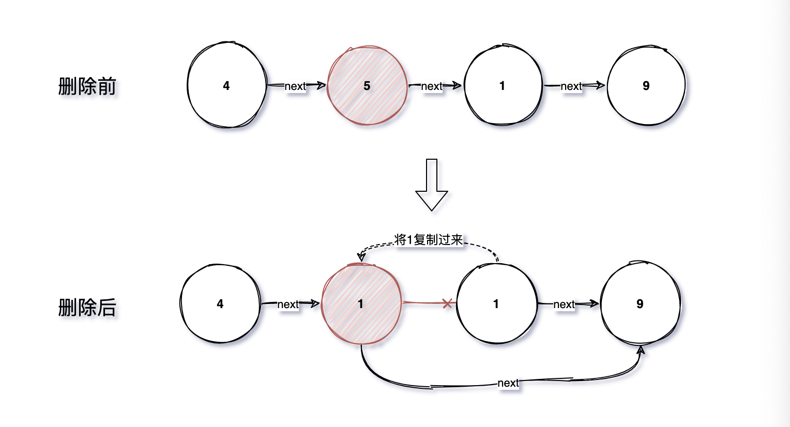
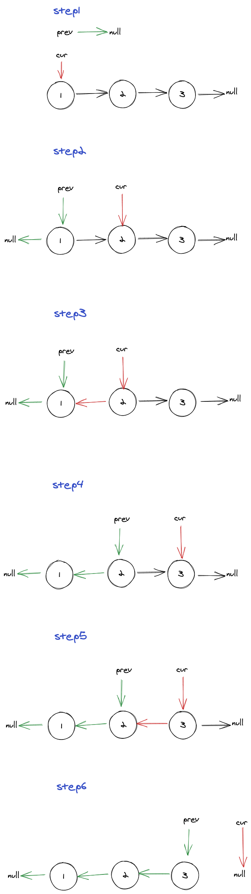

##  [leetcode初级算法(链表篇)](https://leetcode-cn.com/leetbook/read/top-interview-questions-easy/x2t7vj/)

注：**点标题可以查看对应的题目**，本文代码均使用`Javascript`编写。本文代码不一定是最优解，仅供参考，如大佬们有更好的实现，欢迎交流。


### [删除链表中的节点](https://leetcode-cn.com/leetbook/read/top-interview-questions-easy/xnarn7/)

解析：一开始看题目，我也没理解，明明输入案例是两个参数，但是代码里的函数入参却只有一个参数。后来想明白了，就是根据传入的删除结点把列表中对应的节点删了（我删我自己:joy:）。

**其实就是把将删除结点替换成删除结点后面的节点**。



步骤：

1. 将删除结点的下一个结点的值作为删除结点的值；
2. 将删除结点的下一个结点的下一个结点作为删除结点的下一个结点。

代码：

```javascript
/**
 * Definition for singly-linked list.
 * function ListNode(val) {
 *     this.val = val;
 *     this.next = null;
 * }
 */
/**
 * @param {ListNode} node
 * @return {void} Do not return anything, modify node in-place instead.
 */
var deleteNode = function(node) {
    node.val = node.next.val;
    node.next = node.next.next;
};
```


### [删除链表的倒数第N个节点](https://leetcode-cn.com/leetbook/read/top-interview-questions-easy/xn2925/)

解析：单链表只能向后查找，但是这里要删除倒数第N的结点。一般能想到的最简单的做法是，先遍历一遍，记录链表长度，然后在遍历一遍删除对应结点。

为使用一趟扫描实现，我这里想到使用数组将链表的每个节点都存起来，利用数组有三个好处：

1. 可以快速定位倒数第N个结点；
2. 可以知道结点数量；
3. 可以快速返回头结点信息。


步骤：

1. 遍历链表，使用数组存储每个节点；
2. 如果只有一个结点，删除完，头结点就为null，直接返回null；
3. 如果删除的是第一个结点，直接返回数组第二项；
4. 如果删除的是最后一个结点，倒数第2个结点的下一个结点设置为null，返回数组第一项；
5. 如果删除的是中间的节点，删除方式和[题目一](#[删除链表中的节点](https://leetcode-cn.com/leetbook/read/top-interview-questions-easy/xnarn7/))一样，返回数组第一项。

代码：

```javascript
/**
 * Definition for singly-linked list.
 * function ListNode(val, next) {
 *     this.val = (val===undefined ? 0 : val)
 *     this.next = (next===undefined ? null : next)
 * }
 */
/**
 * @param {ListNode} head
 * @param {number} n
 * @return {ListNode}
 */
var removeNthFromEnd = function (head, n) {
    var temp = [];
    while (head) {
        temp.push(head);
        head = head.next;
    }

    // 只有一个结点
    if(temp.length === 1){
        return null;
    }

    // 删除的是第一个结点
    if (n === temp.length) {
        return temp[1];
    } 

    // 删除的是最后一个结点
    if(n === 1){
        temp[temp.length - 2].next = null;
        return temp[0];
    }

    // 删除中间结点
    var deleteNodeIndex = temp.length - n;
    var deleteNode = temp[deleteNodeIndex];
    deleteNode.val = deleteNode.next.val;
    deleteNode.next = deleteNode.next.next;
    return temp[0];

};
```


### [反转链表](https://leetcode-cn.com/leetbook/read/top-interview-questions-easy/xnnhm6/)

#### 双指针法

解析：这里使用的是双指针法，定义两个指针，一个指针比另一个指针快一步，将快的指针的next指向慢的指针，一直迭代到快的指针为null，最后就能实现反转，直接上图:point_down:




步骤：

1. 定义prev和cur指针和temp指针；
2. 用temp存储cur的next;
3. 将cur的next指向prev；
4. prev往前移变成cur；
5. cur往前移变成temp；
6. 循环到cur指向null，prev就是逆转后链表的head。

代码：

```js
/**
 * Definition for singly-linked list.
 * function ListNode(val) {
 *     this.val = val;
 *     this.next = null;
 * }
 */
/**
 * @param {ListNode} head
 * @return {ListNode}
 */
var reverseList = function(head) {
    let prev = null;
    let cur = head;
    let temp = null;
    while(cur !== null){
      	// 记录cur的下一个值
        temp = cur.next;
      	// 当前节点指向上一个节点
        cur.next = prev;
      	// 两个指针都往后指
        prev = cur;
        cur = temp;
    }
    return prev;
};
```


#### 递归

解析：使用递归一直遍历链表到最后，记录最后一个值作为头指针，返回。当前层的heade.next.next等于head，即当前节点的后一个结点指向当前结点，然后head.next等于null，防止回环。


步骤：

1. 递归出口，head为null或者head.next为null，返回head；
2. 当前结点等下一个结点往回指；
3. 断开当前节点原来的next;
4. 返回新head。

代码：

```js
/**
 * Definition for singly-linked list.
 * function ListNode(val) {
 *     this.val = val;
 *     this.next = null;
 * }
 */
/**
 * @param {ListNode} head
 * @return {ListNode}
 */
var reverseList = function(head) {
   if(head === null || head.next === null){
       return head;
   }
   const newHead = reverseList(head.next);
   // 逆转逻辑
   head.next.next = head;
   head.next = null;
   return newHead; //newhead不做操作，直接返回
};
```


### [合并两个有序链表](https://leetcode-cn.com/leetbook/read/top-interview-questions-easy/xnnbp2/)

#### 循环

解析：用一个循环一直遍历到其中一个链表为空，比较过程中，看两个链表当前节点哪个值小，值小的串起来，大的留着下一次循环比较，最后剩下的不为空的拼接在链表最后面。


思路：

1. 定义4个指针，`newHead`保存合并的链表头结点，`p`用于在遍历时表示合并链表的当前节点，`p1`用于保存`l1`遍历过程中的节点，`p2`用于保存`l2`遍历过程中的结点；
2. 开始遍历，比较`p1`结点和`p2`结点值的大小，小的拼在`p`后；
3. 遍历结束，将剩下不为空的链表拼在最后。

代码：

```js
/**
 * Definition for singly-linked list.
 * function ListNode(val, next) {
 *     this.val = (val===undefined ? 0 : val)
 *     this.next = (next===undefined ? null : next)
 * }
 */
/**
 * @param {ListNode} l1
 * @param {ListNode} l2
 * @return {ListNode}
 */
var mergeTwoLists = function (l1, l2) {
    // 如果l1为空，无需判断，直接返回l2
    if (l1 === null) {
        return l2;
    }
    // 同上
    if (l2 === null) {
        return l1;
    }
    let newHead = l1.val <= l2.val ? l1 : l2; // 初始化，newHead指向l1、l2中当前值最小的那个，固定不变
    let p = newHead; // p保存当前合并链表的节点，初始化和newHead一样，遍历的时候用
    let p1 = l1 === p ? l1.next : l1; // 如果p取了l1的第一节点，那么p1从第2个结点开始，否则从第1个结点开始
    let p2 = l2 === p ? l2.next : l2; // 同上
    // 开始遍历，直到其中一个链表遍历完成
    while (p1 !== null && p2 !== null) {
        const val1 = p1.val;
        const val2 = p2.val;
        if (val1 > val2) { // 拼p2
            p.next = p2;
            p2 = p2.next;
            p = p.next;
        } else if (val1 < val2) { // 拼p1
            p.next = p1;
            p1 = p1.next;
            p = p.next;
        } else { // 拼p1、p2
            p.next = p1;
            p1 = p1.next;
            p.next.next = p2;
            p = p.next.next;
            p2 = p2.next;
        }
    }
    // 没遍历完的拼在最后面
    if (p1 !== null) {
        p.next = p1;
    }
    if (p2 !== null) {
        p.next = p2;
    }
    return newHead;
};
```


#### 递归

解析：递归的没一步都连接一个结点，连接小的那一个，在继续比较后续没有比较过的节点。


步骤：

1. 设置递归出口，当一个链表遍历完后，返回另一个链表；
2. 判断两个链表当前节点大小，递归合并剩余结点。

代码：

```js
/**
 * Definition for singly-linked list.
 * function ListNode(val, next) {
 *     this.val = (val===undefined ? 0 : val)
 *     this.next = (next===undefined ? null : next)
 * }
 */

/**
 * @param {ListNode} l1
 * @param {ListNode} l2
 * @return {ListNode}
 */
var mergeTwoLists = function (l1, l2) {
    if (l1 === null) {
        return l2;
    }
    if (l2 === null) {
        return l1;
    }
    if(l1.val > l2.val){
        l2.next = mergeTwoLists(l1, l2.next);
        return l2;
    }else {
        l1.next = mergeTwoLists(l1.next, l2);
        return l1;
    }
};
```


### [回文链表](https://leetcode-cn.com/leetbook/read/top-interview-questions-easy/xnv1oc/)

解析：转成数组，使用两个指针头尾往中间靠拢，遇到不相等直接返回`false`，遍历完成返回`true`。


步骤：

1. 将链表转成数组；
2. 遍历数组，比较两端是否相同；
3. 遍历过程中遇到不相等的直接返回`false`，遍历结束，返回`true`。

代码：

```js
/**
 * Definition for singly-linked list.
 * function ListNode(val, next) {
 *     this.val = (val===undefined ? 0 : val)
 *     this.next = (next===undefined ? null : next)
 * }
 */
/**
 * @param {ListNode} head
 * @return {boolean}
 */
var isPalindrome = function (head) {
    const arr = [];
    while (head) {
        arr.push(head.val);
        head = head.next;
    }
    for (i = 0, j = arr.length - 1; i < j && arr.length > 0; i++ , j--) {
        if (arr[i] !== arr[j]) {
            return false;
        };
    }
    return true;
};
```


### [环形链表](https://leetcode-cn.com/leetbook/read/top-interview-questions-easy/xnwzei/)

#### 快慢指针

解析：使用快慢指针，一个一次走一步，一个一次走两步，只要有环，快指针最后就会等于慢指针。


步骤：

1. 定义快慢指针；
2. 遍历，判断快慢指针是否相等，是，返回`true`；
3. 遍历结束，返回false。

代码：

~~~js
/**
 * Definition for singly-linked list.
 * function ListNode(val) {
 *     this.val = val;
 *     this.next = null;
 * }
 */

/**
 * @param {ListNode} head
 * @return {boolean}
 */
var hasCycle = function(head) {
    let slow = head; // 慢指针
    let fast = head; // 快指针
    while(fast && fast.next){
        slow = slow.next; // 慢指针一次走一步
        fast = fast.next.next; // 快指针一次走两步
        if(fast === slow){ // 相等，证明有环
            return true;
        }
    }
    return false; // 遍历结束，无环
};
~~~


#### 使用Set

解析：遍历链表，查看是否存在当前节点，不存在加入`Set`，存在证明有环。


步骤：

1. 新建一个`Set`集合；
2. 遍历链表，判断`Set`是否存在当前节点，有则证明是第二次遍历同一个结点，返回`true`；
3. 遍历结束没有遍历同一个结点两次，返回`false`。

代码：

```js
/**
 * Definition for singly-linked list.
 * function ListNode(val) {
 *     this.val = val;
 *     this.next = null;
 * }
 */

/**
 * @param {ListNode} head
 * @return {boolean}
 */
var hasCycle = function (head) {
  const s = new Set();
  while (head) {
    if (s.has(head)) {
      return true;
    } else {
      s.add(head);
    }
    head = head.next;
  }
  return false;
};
```

