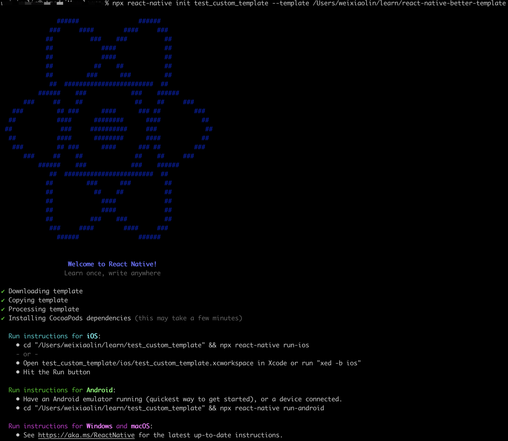

# 手把手教你创建一个自定义react-native项目模板


## 初始化项目

新建一个名为`react-naive-better-template`的文件夹

```powershell
mkdir react-native-better-template
```

初始化工程（可选）

```powershell
yarn init
```


## 创建基础模板

使用`react-native`官方脚手架创建一个基于`typescript`的基础模板

~~~powershell
npx react-native init ProjectName --template react-native-template-typescript --skip-install
~~~

参数解析：

- `init`: 后面跟的是要生成的项目名称
- `--template`: 表示要下载的模板，后面跟的参数可以是github地址，也可以是本地路径的地址。这里使用的是内置的参数，表示要下载的是[react-native官方的ts模板](https://github.com/react-native-community/react-native-template-typescript/blob/master/template.config.js)
- `--skip-install`: 表示下载玩模板后不进行node_modules依赖和pod依赖的安装


**这里有两点需要注意一下**:point_down:

1. 不要使用`template`作为项目名称，不然后面使用该模板生成项目的时候会报错（在修改ios文件夹和文件加名称时会报错），这应该是脚手架的一个bug。
2. 注意加上`--skip-install`参数，模板项目不需要带依赖，否则在生成的时候会因为文件过多报错


（可选）修改一下ProjectName文件加的名称为template，这样看起来直观点，修改完成后的目录结构如下：


## 创建模板配置文件

新建一个名为`template.config.js`的文件，加入如下内容：

```js
module.exports = {
  // Placeholder used to rename and replace in files
  // package.json, index.json, android/, ios/
  placeholderName: "ProjectName",

  // Directory with template
  templateDir: "./template",

  // Path to script, which will be executed after init
  // postInitScript: "./script.js"
};
```

参数解析：

- `placeholderName`:  指定占位符，生成项目时会去查找该参数的值并替换成用户传入的项目名称
- `teamplateDir`: 指定下载模板的路径
- `postInitScript`: 指定初始化完成后要运行的脚本，这里不需要该功能，先注释掉


完成后的目录结构：


## 测试

到此已经完成自定义模板的创建了，你可以根据需要随意修改`template`文件夹中的内容，如加入一些常用的第三方库等。


下面来测试一下，使用自定义模板生成新项目

```powershell
npx react-native init test_custom_template --template your/path/to/template
```

> 将your/path/to/template替换成你的自定义模板路径


测试结果，成功:grin:




