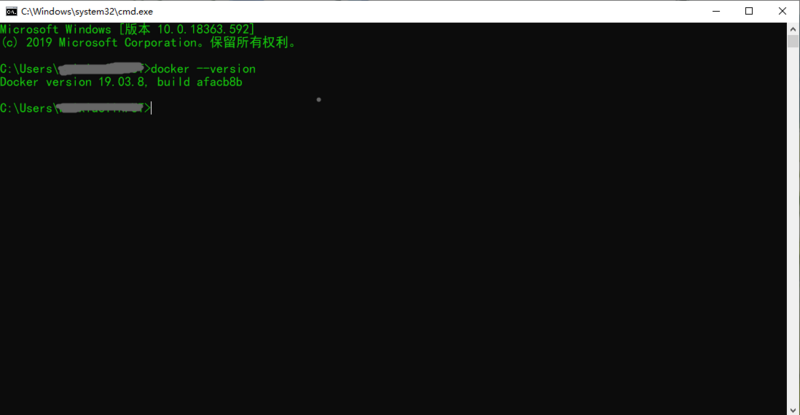
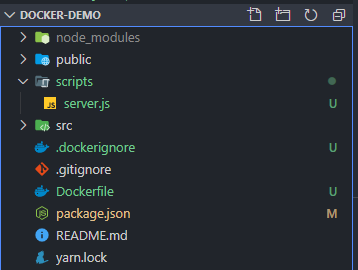
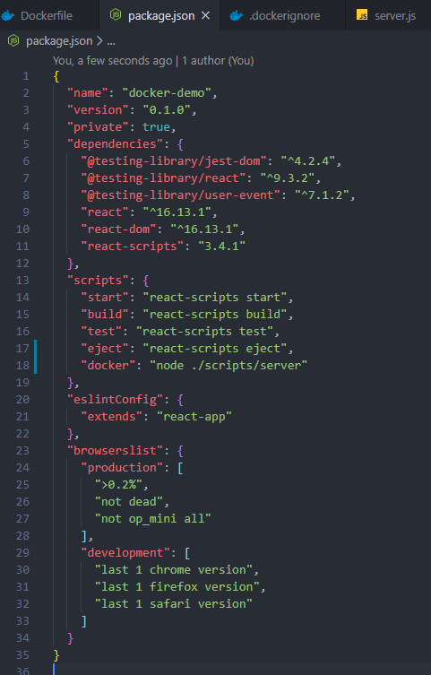
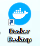
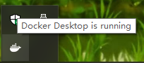
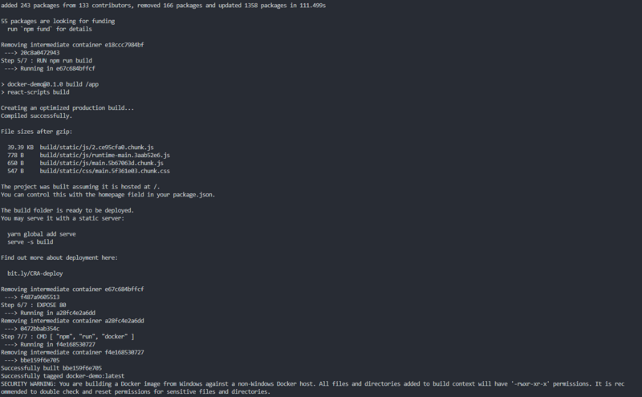
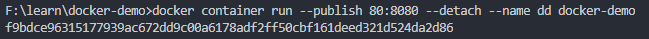
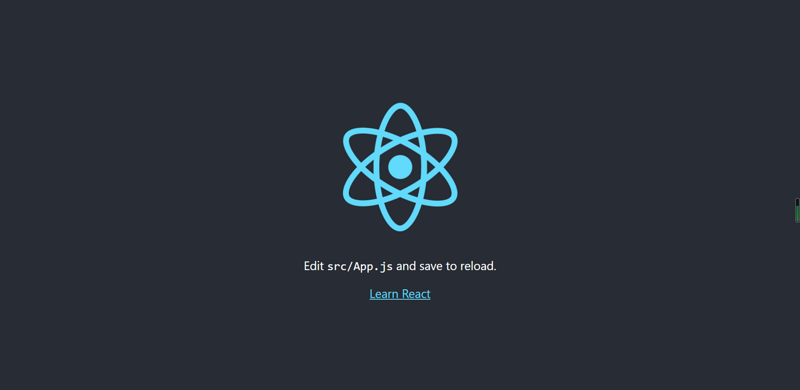

## docker是什么？

可以去看看阮一峰老师的文章：[Docker入门教程](http://www.ruanyifeng.com/blog/2018/02/docker-tutorial.html)，下文不对概念做过多解释，直接上实战步骤。

## 一、下载安装docker💿

> 系统：`windows10`

在[docker官网](https://hub.docker.com/editions/community/docker-ce-desktop-windows/)下载windows版本的安装包安装，下载完成后双击打开，点击下一步下一步安装即可。

### 校验是否安装成功

1. 使用`window + R`，打开运行。

2. 输入`cmd`，回车打开cmd。

3. 输入命令`docker --version`，看到显示打印出docker版本号就说明安装成功了。

    

## 二、准备一个前端项目📁

> 这里使用`create-react-app`脚手架创建一个新的项目。

1. 打开`cmd`运行命令，创建一个名为`docker-demo`的项目。

    ```
    npx create-react-app docker-demo
    ```
2. 在项目根目录新建`scripts`文件夹，再新建`server.js`。用于编写node服务器，运行打包后的代码。

3. 在根目录创建`Dockerfile`文件，用于运行指定创建镜像时要运行的docker命令。

4. 在根目录创建`.dockerignore`文件，用于加入`docker`忽略文件。

创建完成后的目录结构如下：



## 三、编写node服务器📫

在`server.js`文件中加入如下代码：

```js
const express = require("express"); //引入express模块
const path = require("path"); //引入path模块

const app = new express(); //创建一个express实例

app.use(express.static(path.join(__dirname, "../build"))); //监听build文件夹下的文件

//监听8080端口
app.listen(8080, function() {
  console.log(path.join(__dirname, "../build"));
  console.log("服务器已启动");
});
```

## 四、编写Dockerfile🐋

1. 在`编写Dockerfile`文件中加入如下代码：

    ```Dockerfile
    # 使用最新的长期维护版本node作为基础镜像
    FROM node:lts

    # 将当期目录下的文件拷贝到linux系统的app文件夹下
    COPY . /app/

    # 使用app文件夹作为工作目录
    WORKDIR /app

    # 设置npm的镜像为淘宝镜像，安装依赖
    RUN npm config set registry https://registry.npm.taobao.org && npm install

    # 运行build命令 
    RUN npm run build

    # 暴露docker容器的80端口
    EXPOSE 80

    # 运行docker脚本命令
    CMD [ "npm", "run", "docker" ]
    ```

2. 在`package.json`文件中加入`sciprts`命令:

    ```
    "docker": "node ./scripts/server"
    ```
    
    

3. 在`.dockerignore`加入如下代码：
    ```
    node_modules
    .git
    ```

## 五、部署docker🐳

1. 运行`docker`，双击`Docker Desktop`图标。

    
    
   启动需要等一段时间，在任务栏,将鼠标放在`docker`图标上,看到`Docker Desktop is running`说明运行成功了。
   
   

2. 打包镜像，在项目根目录运行命令，这个命令也要跑很久，可以先去泡杯枸杞菊花茶🍺：

    ```docker
    docker image build -t docker-demo .
    ```
    
    看到`Successfully built`字样说明打包成功了。
    
    
    
3. 使用镜像运行一个容器:
    
    ```docker
    docker container run --publish 80:8080 --detach --name dd docker-demo
    ```
    
    运行成功会出来一串hash值
    
    

4. 最后打开浏览器，输入`localhost`就可看到页面啦😀

    
    
## 后记🙄

如果要实现代码自动化打包部署，这只是其中的一步，还要结合`jenkins`使用。

> 自动部署就是在你提交代码之后，就能在服务器触发代码打包和运行，再也不用进行手动打包代码、提交代码这种重复又没有意义的工作，极大地解放了劳动力🙉。

**最后附上常用`docker`命令:**

##### 将当前文件夹下的文件打包成一个镜像文件

```docker
docker image build -t [标签名称] .
```

##### 运行container

```docker
docker container run --publish [暴露接口]:[程序运行接口] --detach --name [container名称] [image名称]
```

##### 查看本机所有的image文件

```docker
docker image ls
```

##### 从docker hub拉取image文件

```docker
docker image pull [仓库名]
```

##### 关闭容器

```docker
docker container kill [容器id]
```

##### 列出本机正在运行的容器

```docker
docker container ls

```docker
##### 列出本机所有容器，包括终止运行的容器

```docker
docker container ls --all
```

##### 删除容器

```docker
docker container rm [containerID]
```
